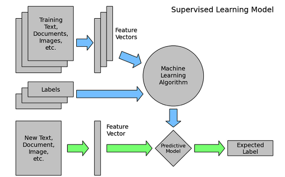
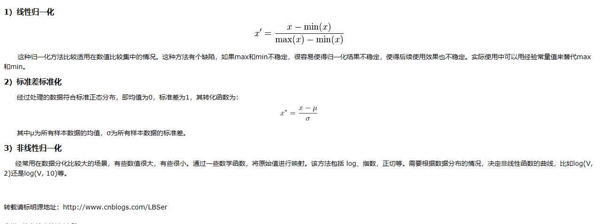

##机器学习方面的面试主要分成三个部分： 
	1. 算法和理论基础   
	2. 工程实现能力与编码水平
	3. 业务理解和思考深度
	

[如何准备机器学习工程师的面试 ？](https://www.zhihu.com/question/23259302)  
[偏差与方差，欠拟合与过拟合](https://blog.csdn.net/hurry0808/article/details/78148756)  
[机器学习常见算法分类，算法优缺点汇总](https://blog.csdn.net/ycm1101743158/article/details/70170549)  
[支持向量机SVM](https://blog.csdn.net/macyang/article/details/38782399/)  
[SMO原理](https://blog.csdn.net/luoshixian099/article/details/51227754)

##机器学习 开发流程
[实例详解机器学习如何解决问题](https://blog.csdn.net/liugallup/article/details/51082653)

	有监督的机器学习在解决实际问题时，有两个流程，
	一个是离线训练流程（蓝色箭头），
		包含
		数据筛选和清洗、
		特征抽取、
		模型训练
		优化模型等环节；
	另一个流程则是应用流程（绿色箭头），
		对需要预估的数据，抽取特征，应用离线训练得到的模型进行预估，获得预估值作用在实际产品中。
	在这两个流程中，离线训练是最有技术挑战的工作（在线预估流程很多工作可以复用离线训练流程的工作），所以下文主要介绍离线训练流程。

	- 对问题建模
	- 准备训练数据
	- 抽取特征
	- 训练模型
	- 优化模型

	综上所述，机器学习解决问题涉及到问题建模、准备训练数据、抽取特征、训练模型和优化模型等关键环节，有如下要点：

	理解业务，分解业务目标，规划模型可预估的路线图。
	数据：
	y数据尽可能真实客观；
	训练集/测试集分布与线上应用环境的数据分布尽可能一致。
	特征：
	利用Domain Knowledge进行特征抽取和选择；
	针对不同类型的模型设计不同的特征。
	模型：
	针对不同业务目标、不同数据和特征，选择不同的模型；
	如果模型不符合预期，一定检查一下数据、特征、模型等处理环节是否有bug；
	考虑模型Underfitting和Qverfitting，针对性地优化。

***
***

##通用机器学习流程与问题解决架构模板
[通用机器学习流程与问题解决架构模板](https://blog.csdn.net/han_xiaoyang/article/details/52910022)

## 生成模型和判别模型
[https://blog.csdn.net/sinat_26230689/article/details/52332030](https://blog.csdn.net/sinat_26230689/article/details/52332030)

	
###1.struct和class区别，你更倾向用哪个  

		这是c，不懂
 
###2.kNN，朴素贝叶斯，SVM的优缺点，朴素贝叶斯的核心思想，有没有考虑属性之间不是相互独立的情况 

[https://blog.csdn.net/u010159842/article/details/52918815](https://blog.csdn.net/u010159842/article/details/52918815)  
[深入理解朴素贝叶斯 Naive Bayes](https://blog.csdn.net/li8zi8fa/article/details/76176597)

	朴素贝叶斯:
		属于生成式模型（关于生成模型和判别式模型，主要还是在于是否是要求联合分布），
		
		优点：
		朴素贝叶斯模型发源于古典数学理论，有着坚实的数学基础，以及稳定的分类效率。
		对小规模的数据表现很好，能个处理多分类任务，适合增量式训练；
		对缺失数据不太敏感，算法也比较简单，常用于文本分类。
		
		缺点：
		需要计算先验概率；
		分类决策存在错误率；
		对输入数据的表达形式很敏感。
		不能学习特征间的相互作用，用mRMR中R来讲，就是特征冗余

###3. 10亿个整数，1G内存，O(n)算法，统计只出现一次的数。
		https://blog.csdn.net/u010983881/article/details/75097358
###4.SVM非线性分类，核函数的作用 

###5. 海量数据排序 
		https://www.cnblogs.com/v-July-v/archive/2012/03/22/2413055.html
###6.项目中的数据是否会归一化处理，哪个机器学习算法不需要归一化处理 
	1）归一化后加快了梯度下降求最优解的速度；
	2）归一化有可能提高精度。下面我简单扩展解释下这两点。

[http://www.cnblogs.com/LBSer/p/4440590.html](http://www.cnblogs.com/LBSer/p/4440590.html)
[https://blog.csdn.net/zbc1090549839/article/details/44103801](https://blog.csdn.net/zbc1090549839/article/details/44103801)	
	
归一化的类型

###7.两个数组，求差集 
[https://blog.csdn.net/u012412259/article/details/53175473](https://blog.csdn.net/u012412259/article/details/53175473)

###8.开放性问题：每个实体有不同属性，现在有很多实体的各种属性数据，如何判断两个实体是否是同一种东西 

###	9.写程序实现二分查找算法，给出递归和非递归实现，并分析算法的时间复杂度。 

###	10.用C/C++实现单链表的反转。 

###	11.python读取文件，写代码 
		

###12.python计算一个文件中有N行，每行一列的数的平均值，方差，写代码 

###13.C++求两个一维数组的余弦相似度，写代码 
###	14.SVM详细过程，支持向量，几何间隔概念，拉格朗日函数如何求取超平面，非线性分类 
###	15.海量数据中求取出现次数最大的100个数。
###	16.字符串翻转，手写
###	17.快排，手写
###	18.KNN（分类与回归）、CART（回归树用平方误差最小化准则，分类树用基尼指数最小化准则）、Logistics（推导）、GBDT（利用损失函数的负梯度在当前模型的值作为回归问题提升树算法中的残差的近似值，拟合一个回归树）、随机森林（Bagging+CART）

###	19. 非递归的二叉前序遍历 && 两个字符串的复制（除了字符串地址重叠的情况，也要注意判断字符串本身的空间足够不足够，对于异常情况要考虑全面）
	
###20.一个概率题目： 6个LED灯管，找整体旋转180'后仍然是一个正常输入的情况（考虑全即可） 
###21. 给一个情境，考察你对于机器学习算法的了解程度以及常用情境的了解（要特别注意思维要开阔，我就是陷入某一个）

###22.一个数组，如果存在两个数之和等于第三个数，找出满足这一条件的最大的第三个数（设为x+y =c）
	
###23.聚类和分类有什么区别？

	分类是事先知道类标的，而聚类事先不知道类标。
	分类：按照某种标准给对象贴标签，再根据标签区分归类
	聚类：事先没有标签而通过某种成因找出事物之间存在聚集性原因的过程
	区别：分类事先定义好类别，类别数不变。分类器需要由人工标注的分类训练语料训练得到，属于指导学习范畴。分类法适合类别或分类体系确定的场合，比如按照国图分类法分类图书。
	聚类则没有事先预定的类，类别数不确定。聚类不需要人工标注和预先训练分类器，类别在聚类的过程中自动生成。聚类法适合不存在分类体系、类别数不确定的场合，一般作为某些应用的前端，比如多文档文摘、搜索引擎和后聚类（元搜索）等。

###24.快速排序，怎样将二叉排序树变成双向链表，且效率最高，从栈里找最小的元素，且时间复杂度为常数级，

###	25.神经网络,plsi的推导，还有float转string,判断一棵树是否是另一棵的子树。

###	26.写写SVM的优化形式、推导SVM
	
###27.在一个n*n的矩阵中填数的问题，那种转圈填数，上网搜搜有 
###28.链表存在环问题，环的第一个节点在哪里？ 
###29.几个排序算法，必须写出
###	30.用拉格朗日公式推导SVM kernel变换
###	31.数据结构当中的树，都有哪些？
###	32.推荐系统
###	33.输出一个循环矩阵，这个我想的有点复杂了，简单的循环即可实现，我用了递归
### 34.翻转字符串，《剑指offer》原题 
###35.确定链表中环的起始位置
	36.N个数找K大数那个题,堆解释了一遍,比较满意,问还能怎么优化O(Nlogk)的方法，并行方面想
	37.一个班60个人怎么保证有两个人生日相同,听完后有点奇怪,①为什么是60个人?②为什么是保证?,反正没管这么多就是概率嘛,算就完了. 38.问一个字符串怎么判断是邮箱比如:vzcxn@sdf.gre.有限状态自动机,然后要我画状态转移图. 39.快排的空间复杂度,答O(n).归并的空间复杂度,答O(n).他让我好好想想,我想了会,难道空间复杂度的常数不能省吗?然后做了修改,快排是O(n)归并是O(2n). 40.给10^10个64位数,100M内存的空间排序,感谢队长刚好在去的前一天教过我一个求中位数的方法.用文件操作来做了,像快排一样,二分选个数统计大于那个数的数量和小于那个数的数量,如果能用100M的空间排序就把那些数排了,如果不能继续.直到能排为止. 41.main(argc,argv[])里面两个参数什么意思 42.kmp算法 43.电梯问题 44.一个应用题，考察hash算法
	45.求最大字段和，用动态规划和分治法两个方法，时间复杂度怎么算 46.写了一下二分查找算法的代码
	47.统计字符串中出现的字符个数，忽略大小写，其中可能有其他字符。 48.一个文件2G内容是userid,username 一个文件3G内容是username,userpassword 要求：输出userid,userpassword 8核cpu 2G内存
	49.贝叶斯概率、卷积
	50.寻找二叉树的公共父节点
	51.通过寻找两条路径，然后寻找最后一个公共节点。
	52.SVM核函数，合并两个文件的问题
	53.b+ b-树、红黑树、要求写出排序算法
	54.判断两条链表是否交叉。
	55.归并排序，random指针的链表复制等
	56.树的广度、深度遍历，
###57.L1和L2的区别

[https://blog.csdn.net/w5688414/article/details/78046960](https://blog.csdn.net/w5688414/article/details/78046960)
[https://blog.csdn.net/nature_xd/article/details/61196470](https://blog.csdn.net/nature_xd/article/details/61196470)

###58.生成与判别模型
	
###59.隐式马尔科夫
[https://blog.csdn.net/sight_/article/details/43307581](https://blog.csdn.net/sight_/article/details/43307581)
	
###60.SVM：中文分词
	61.关联分析、aprior
	62.各类算法优缺点、模型调优细节
	63.特征提取的方法（无关键词也是一个特征）
	64.稳定与不稳定排序
	65.RBF核与高斯核的区别
	
###66.Python实现LogReg
[https://blog.csdn.net/baimafujinji/article/details/51151851](https://blog.csdn.net/baimafujinji/article/details/51151851)
	
###67.ROC与AUC
[https://blog.csdn.net/shenxiaoming77/article/details/72627882](https://blog.csdn.net/shenxiaoming77/article/details/72627882)

###	68.K-means起始点
	69.深度学习和机器学习的区别、数据挖掘和人工智能的区别、测试集和训练集的区别kmeans，FCM，SVM算法的具体流程、如何优化kmeans算法
	70.二叉树前序遍历非递归实现，大家总结一下前序，中序，后序遍历的非递归实现，尝试多几种方法会有不一样的收获。
	71. Deep CNN, Deep RNN, RBM的典型应用与局限，看Hinton讲义和Paper去吧
	72. 有哪些聚类方法？
	73. 判断一个链表是否存在环？回 答：通过两个指针，快慢指针进行遍历。
	74. 正则化是怎么回事（L1和L2）
	75.PCA
	76. 学校食堂如何应用数据挖掘的知识
	77. 哪些模型容易过拟合，模型怎么选择
	78. 什么是模糊聚类，还有划分聚类，层次聚类等
	79. 最长上升子序列啊，两个大小相同的有序数组找公共中位数
	80. 并行计算、压缩算法
	81.SVD、LDA
	82. naive bayes和logistic regression的区别 83.LDA的原理和推导 84.做广告点击率预测，用哪些数据什么算法 85.推荐系统的算法中最近邻和矩阵分解各自适用场景 86.用户流失率预测怎么做（游戏公司的数据挖掘都喜欢问这个） 87.一个游戏的设计过程中该收集什么数据 88.如何从登陆日志中挖掘尽可能多的信息
	89. 统计学习的核心步骤：模型、策略、算法，你应当对logistic、SVM、决策树、KNN及各种聚类方法有深刻的理解。能够随手写出这些算法的核心递归步的伪代码以及他们优化的函数表达式和对偶问题形式。
	90. 梯度下降、牛顿法、各种随机搜索算法（基因、蚁群等等）

###1 面试案例
	
	SVM的原理，SVM里面的核
	K-means，如何用hadoop实现k-means
	naive bayes和logistic regression的区别
	LDA的原理和推导
	做广告点击率预测，用哪些数据什么算法
	推荐系统的算法中最近邻和矩阵分解各自适用场景
	用户流失率预测怎么做（游戏公司的数据挖掘都喜欢问这个）
	一个游戏的设计过程中该收集什么数据
	如何从登陆日志中挖掘尽可能多的信息
	这些问题我回答的情况，分几种。一种是在面试官的提示下，算是勉强完成了答案。一种是在面试官的提示下，答了一点但是答得不够好。一种是面试官不提示也没有反馈，我回答了但是我不知道回答得怎样。
	我非常后悔的一点是我现在才想起来总结。有一个题是游戏玩家流失率预测，我被问过两次。但是每次我都说是个分类问题。最近我突然想起来去网上查了下，有两个点，数据不平衡问题和时间序列分析。我网上查到是一个大学教授和人人游戏合作的课题。我然后查了下这个老师的publication。没发现相关的论文。可能公司不让发表吧。
	这些问题的特点是很基础很简单，因为实际中很少用复杂的算法，复杂的算法不好控制，而且理论要求高。另一个特点是注重考查实际工程能力，我经常被问到自己实现了哪些算法。还有的问题很契合实际。
	我觉得如果现在再给我准备的机会。我会准备下面几点。
	首先是计算机基础知识和算法，这些都是会正常考察的。有些公司考的少，有些公司正常考察。
	针对机器学习这部分，需要理论扎实，还需要自己动手实现代码。另外hadoop，mpi，最近比较火的spark，应该都是加分项。另一个是接触下实际的数据分析系统。我在学校里面看的论文，都是讲算法的多，讲应用系统的少。这个可以靠之前的实习，也可以看些比较实用的论文