1. 课程介绍 

2. 机器学习 （Machine Learning, ML)
     
     2.1 概念：多领域交叉学科，涉及概率论、统计学、逼近论、凸分析、算法复杂度理论等多门学科。专门研究计算机怎样模拟或实现人类的学习行为，以获取新的知识或技能，重新组织已有的知识结构使之不断改善自身的性能。

     2.2 学科定位：人工智能(Artificial Intelligence, AI）的核心，是使计算机具有智能的根本途径，其应用遍及人工智能的各个领域，它主要使用归纳、综合而不是演绎。
     
     2.3 定义：探究和开发一系列算法来如何使计算机不需要通过外部明显的指示，而可以自己通过数据来学习，建模，并且利用建好的模型和新的输入来进行预测的学科。
          
         Arthur Samuel (1959): 一门不需要通过外部程序指示而让计算机有能力自我学习的学科

         Langley（1996) ： “机器学习是一门人工智能的科学，该领域的主要研究对象是人工智能，特别是如何在经验学习中改善具体算法的性能”

         Tom Michell (1997):  “机器学习是对能通过经验自动改进的计算机算法的研究”

     2.4： 学习：针对经验E (experience) 和一系列的任务 T (tasks) 和一定表现的衡量 P，如果随之经验E的积累，针对定义好的任务T可以提高表现P，就说计算机具有学习能力

              例子： 下棋，语音识别，自动驾驶汽车等

3. 机器学习的应用：

     语音识别
     自动驾驶
     语言翻译
     计算机视觉
     推荐系统
     无人机
     识别垃圾邮件

4. Demo：
     人脸识别
     无人驾驶汽车
     电商推荐系统
     
5. 置业市场需求：LinkedIn所有职业技能需求量第一：机器学习，数据挖掘和统计分析人才

***
***
1. 机器学习更多应用举例： 人脸识别

2. 机器学习就业需求：
     LinkedIn所有职业技能需求量第一：机器学习，数据挖掘和统计分析人才
     http://blog.linkedin.com/2014/12/17/the-25-hottest-skills-that-got-people-hired-in-2014/

3.  深度学习(Deep Learning)

3.1 什么是深度学习？

          深度学习是基于机器学习延伸出来的一个新的领域，由以人大脑结构为启发的神经网络算法为起源加之模型结构深度的增加发展，并伴随大数据和计算能力的提高而产生的一系列新的算法。
     

3.2 深度学习什么时间段发展起来的？

          其概念由著名科学家Geoffrey Hinton等人在2006年和2007年在《Sciences》等上发表的文章被提出和兴起。

3.3 学习能用来干什么？为什么近年来引起如此广泛的关注？

          深度学习，作为机器学习中延伸出来的一个领域，被应用在图像处理与计算机视觉，自然语言处理以及语音识别等领域。自2006年至今，学术界和工业界合作在深度学习方面的研究与应用在以上领域取得了突破性的进展。以ImageNet为数据库的经典图像中的物体识别竞赛为例，击败了所有传统算法，取得了前所未有的精确度。

3.4 深度学习目前有哪些代表性的学术机构和公司走在前沿？人才需要如何？

           学校以多伦多大学，纽约大学，斯坦福大学为代表，工业界以Google, Facebook, 和百度为代表走在深度学习研究与应用的前沿。Google挖走了Hinton，Facebook挖走了LeCun，百度硅谷的实验室挖走了Andrew Ng，Google去年4月份以超过5亿美金收购了专门研究深度学习的初创公司DeepMind, 深度学习方因技术的发展与人才的稀有造成的人才抢夺战达到了前所未有激烈的程度。诸多的大大小小(如阿里巴巴，雅虎）等公司也都在跟进，开始涉足深度学习领域，深度学习人才需求量会持续快速增长。

3.5深度学习如今和未来将对我们生活造成怎样的影响？
          目前我们使用的Android手机中google的语音识别，百度识图，google的图片搜索，都已经使用到了深度学习技术。Facebook在去年名为DeepFace的项目中对人脸识别的准备率第一次接近人类肉眼（97.25% vs 97.5%)。大数据时代，结合深度学习的发展在未来对我们生活的影响无法估量。保守而言，很多目前人类从事的活动都将因为深度学习和相关技术的发展被机器取代，如自动汽车驾驶，无人飞机，以及更加职能的机器人等。深度学习的发展让我们第一次看到并接近人工智能的终极目标。

          

4.0 深度学习的应用展示： 

     4.1 无人驾驶汽车中的路标识别
     4.2 Google Now中的语音识别
     4.3 百度识图
     4.4 针对图片，自动生成文字的描述：
          
     

“A person riding a motorcycle on a dirt road,”

****
****
###1. 基本概念：训练集，测试集，特征值，监督学习，非监督学习，半监督学习，分类，回归 

###2. 概念学习：人类学习概念：鸟，车，计算机

    定义：概念学习是指从有关某个布尔函数的输入输出训练样例中推断出该布尔函数

###3. 例子：学习 “享受运动"  这一概念：
     
     小明进行水上运动，是否享受运动取决于很多因素

     
样例
天气
温度
湿度
风力
水温
预报
享受运动
1
晴
暖
普通
强
暖
一样
是
2
晴
暖
大
强
暖
一样
是
3
雨
冷
大
强
暖
变化
否
4
晴
暖
大
强
冷
变化
是

     天气：晴，阴，雨 
     温度：暖，冷
     湿度：普通，大
     风力：强，弱
     水温：暖，冷
     预报：一样，变化
     
     享受运动：是，否

     概念定义在实例(instance)集合之上，这个集合表示为X。（X：所有可能的日子，每个日子的值由 天气，温度，湿度，风力，水温，预          报6个属性表示。
     待学习的概念或目标函数成为目标概念（target concept), 记做c。
     c(x) = 1, 当享受运动时， c(x) = 0 当不享受运动时，c(x)也可叫做y
     x: 每一个实例
     X: 样例, 所有实例的集合
     学习目标：f: X -> Y
     
###4. 训练集(training set/data)/训练样例（training examples): 用来进行训练，也就是产生模型或者算法的数据集

    测试集(testing set/data)/测试样例 (testing examples)：用来专门进行测试已经学习好的模型或者算法的数据集
    特征向量(features/feature vector)：属性的集合，通常用一个向量来表示，附属于一个实例
    标记(label): c(x), 实例类别的标记
    正例(positive example)
    反例(negative example)
     

###5. 例子：研究美国硅谷房价

    影响房价的两个重要因素：面积(平方米），学区（评分1-10）
   
     
<table width="100%" border="1" cellspacing="0" cellpadding="2"><tbody><tr><td valign="top">样例</td><td valign="top">面积（平方米）</td><td valign="top">学区 （1<a style="color:#69aa35" href="evernote:///view/2964732/s27/a1093f84-1e48-4946-b408-268745a64a67/a1093f84-1e48-4946-b408-268745a64a67/">1.2 深度学习(Deep Learning)介绍</a>-10）</td><td valign="top">房价 （1000$)</td></tr><tr><td valign="top">1</td><td valign="top">100</td><td valign="top">8</td><td valign="top">1000</td></tr><tr><td valign="top">2</td><td valign="top">120</td><td valign="top">9</td><td valign="top">1300</td></tr><tr><td valign="top">3</td><td valign="top">60</td><td valign="top">6</td><td valign="top">800</td></tr><tr><td valign="top">4</td><td valign="top">80</td><td valign="top">9</td><td valign="top">1100</td></tr><tr><td valign="top">5</td><td valign="top">95</td><td valign="top">5</td><td valign="top">850</td></tr></tbody></table>

     
     
###6  分类 (classification): 目标标记为类别型数据(category) 
   
	 回归(regression): 目标标记为连续性数值 (continuous numeric value)
     

###7 例子：研究肿瘤良性，恶性于尺寸，颜色的关系

     特征值：肿瘤尺寸，颜色
     标记：良性/恶性
     
     有监督学习(supervised learning)： 训练集有类别标记(class label)
     无监督学习(unsupervised learning)： 无类别标记(class label)
     半监督学习（semi-supervised learning)：有类别标记的训练集 + 无标记的训练集
     

8. 机器学习步骤框架

     8.1 把数据拆分为训练集和测试集
     8.2 用训练集和训练集的特征向量来训练算法
     8.2 用学习来的算法运用在测试集上来评估算法 （可能要设计到调整参数（parameter tuning), 用验证集（validation set）

100 天： 训练集
10天：测试集 （不知道是否 ” 享受运动“， 知道6个属性，来预测每一天是否享受运动）

***
***
###0. 机器学习中分类和预测算法的评估：

1. 准确率
1. 速度
1. 强壮行
1. 可规模性
1. 可解释性

###1. 什么是决策树/判定树（decision tree)? 
     
     判定树是一个类似于流程图的树结构：其中，每个内部结点表示在一个属性上的测试，每个分支代表一个属性输出，而每个树叶结点代表类或类分布。树的最顶层是根结点。

###2.  机器学习中分类方法中的一个重要算法

###3.  构造决策树的基本算法                   

     3.1 熵（entropy）概念：

          信息和抽象，如何度量？
          1948年，香农提出了 ”信息熵(entropy)“的概念
          一条信息的信息量大小和它的不确定性有直接的关系，要搞清楚一件非常非常不确定的事情，或者          
          是我们一无所知的事情，需要了解大量信息==>信息量的度量就等于不确定性的多少
          
          例子：猜世界杯冠军，假如一无所知，猜多少次？
          每个队夺冠的几率不是相等的
          
          比特(bit)来衡量信息的多少

          

          

          变量的不确定性越大，熵也就越大
          

     3.1 决策树归纳算法 （ID3）

          1970-1980， J.Ross. Quinlan, ID3算法
     
          选择属性判断结点

          信息获取量(Information Gain)：Gain(A) = Info(D) - Infor_A(D)
          通过A来作为节点分类获取了多少信息

     
  
  
        
          

           类似，Gain(income) = 0.029, Gain(student) = 0.151, Gain(credit_rating)=0.048

          所以，选择age作为第一个根节点

  

          重复。。。

          算法：
			树以代表训练样本的单个结点开始（步骤1）。
			如果样本都在同一个类，则该结点成为树叶，并用该类标号（步骤2 和3）。
			否则，算法使用称为信息增益的基于熵的度量作为启发信息，选择能够最好地将样本分类的属性（步骤6）。该属性成为该结点的“测试”或“判定”属性（步骤7）。在算法的该版本中，
			所有的属性都是分类的，即离散值。连续属性必须离散化。
			对测试属性的每个已知的值，创建一个分枝，并据此划分样本（步骤8-10）。
			算法使用同样的过程，递归地形成每个划分上的样本判定树。一旦一个属性出现在一个结点上，就不必该结点的任何后代上考虑它（步骤13）。
			递归划分步骤仅当下列条件之一成立停止：
			(a) 给定结点的所有样本属于同一类（步骤2 和3）。
			(b) 没有剩余属性可以用来进一步划分样本（步骤4）。在此情况下，使用多数表决（步骤5）。
			这涉及将给定的结点转换成树叶，并用样本中的多数所在的类标记它。替换地，可以存放结
			点样本的类分布。
			(c) 分枝
			test_attribute = a i 没有样本（步骤11）。在这种情况下，以 samples 中的多数类
			创建一个树叶（步骤12）

               

     3.1 其他算法：
               C4.5:  Quinlan
               Classification and Regression Trees (CART): (L. Breiman, J. Friedman, R. Olshen, C. Stone)
               共同点：都是贪心算法，自上而下(Top-down approach)
               区别：属性选择度量方法不同： C4.5 （gain ratio), CART(gini index), ID3 (Information Gain)

     3.2 如何处理连续性变量的属性？ 

###4. 树剪枝叶 （避免overfitting)
     4.1 先剪枝
     4.2 后剪枝

###5. 决策树的优点：
     直观，便于理解，小规模数据集有效     

###6. 决策树的缺点：
     处理连续变量不好
     类别较多时，错误增加的比较快
     可规模性一般（
****
****
###1. Python 

###2.  Python机器学习的库：scikit-learn

      2.1： 特性：
		简单高效的数据挖掘和机器学习分析
		对所有用户开放，根据不同需求高度可重用性
		基于Numpy, SciPy和matplotlib
		开源，商用级别：获得 BSD许可

     2.2 覆盖问题领域：
          分类（classification), 回归（regression), 聚类（clustering), 降维(dimensionality reduction)
          模型选择(model selection), 预处理(preprocessing)

###3. 使用用scikit-learn
     安装scikit-learn: pip, easy_install, windows installer
     安装必要package：numpy， SciPy和matplotlib， 可使用Anaconda (包含numpy, scipy等科学计算常用
     package）
     安装注意问题：Python解释器版本（2.7 or 3.4？）, 32-bit or 64-bit系统

###4. 例子：
     
 

      文档： http://scikit-learn.org/stable/modules/tree.html

      解释Python代码

      安装 Graphviz： http://www.graphviz.org/
      配置环境变量

      转化dot文件至pdf可视化决策树：dot -Tpdf iris.dot -o outpu.pdf   

***
***
##1. 综述 
     1.1 Cover和Hart在1968年提出了最初的邻近算法
     1.2 分类(classification)算法
     1.3 输入基于实例的学习(instance-based learning), 懒惰学习(lazy learning)

##2. 例子：

  

    未知电影属于什么类型？
  
 
 
 

         

##3. 算法详述

     3.1 步骤：
     为了判断未知实例的类别，以所有已知类别的实例作为参照
     选择参数K
     计算未知实例与所有已知实例的距离
     选择最近K个已知实例
     根据少数服从多数的投票法则(majority-voting)，让未知实例归类为K个最邻近样本中最多数的类别

     3.2 细节:
     关于K
     关于距离的衡量方法:
         3.2.1 Euclidean Distance 定义
 
               
               
     
     
     其他距离衡量：余弦值（cos）, 相关度 （correlation）, 曼哈顿距离 （Manhattan distance）
               

     3.3 举例
 
     
     

##4. 算法优缺点：
     4.1 算法优点
          简单
          易于理解
          容易实现
          通过对K的选择可具备丢噪音数据的健壮性
          
     4.2 算法缺点
 
          
          需要大量空间储存所有已知实例
          算法复杂度高（需要比较所有已知实例与要分类的实例）
          当其样本分布不平衡时，比如其中一类样本过大（实例数量过多）占主导的时候，新的未知实例容易被归类为这个主导样本，因为这类样本实例的数量过大，但这个新的未知实例实际并木接近目标样本

##5. 改进版本
      考虑距离，根据距离加上权重
      比如: 1/d (d: 距离）

***
***
##1 数据集介绍： 

虹膜

150个实例

萼片长度，萼片宽度，花瓣长度，花瓣宽度
(sepal length, sepal width, petal length and petal width）

类别：
Iris setosa, Iris versicolor, Iris virginica.

##2. 利用Python的机器学习库sklearn: SkLearnExample.py

<pre>
from sklearn import neighbors
from sklearn import datasets

knn = neighbors.KNeighborsClassifier()

iris = datasets.load_iris()

print iris

knn.fit(iris.data, iris.target)

predictedLabel = knn.predict([[0.1, 0.2, 0.3, 0.4]])

print predictedLabel
</pre>

##3. KNN 实现Implementation:

<pre>
# Example of kNN implemented from Scratch in Python

import csv
import random
import math
import operator

def loadDataset(filename, split, trainingSet=[] , testSet=[]):
    with open(filename, 'rb') as csvfile:
        lines = csv.reader(csvfile)
        dataset = list(lines)
        for x in range(len(dataset)-1):
            for y in range(4):
                dataset[x][y] = float(dataset[x][y])
            if random.random() < split:
                trainingSet.append(dataset[x])
            else:
                testSet.append(dataset[x])

def euclideanDistance(instance1, instance2, length):
    distance = 0
    for x in range(length):
        distance += pow((instance1[x] - instance2[x]), 2)
    return math.sqrt(distance)

def getNeighbors(trainingSet, testInstance, k):
    distances = []
    length = len(testInstance)-1
    for x in range(len(trainingSet)):
        dist = euclideanDistance(testInstance, trainingSet[x], length)
        distances.append((trainingSet[x], dist))
    distances.sort(key=operator.itemgetter(1))
    neighbors = []
    for x in range(k):
        neighbors.append(distances[x][0])
    return neighbors

def getResponse(neighbors):
    classVotes = {}
    for x in range(len(neighbors)):
        response = neighbors[x][-1]
        if response in classVotes:
            classVotes[response] += 1
        else:
            classVotes[response] = 1
    sortedVotes = sorted(classVotes.iteritems(), key=operator.itemgetter(1), reverse=True)
    return sortedVotes[0][0]

def getAccuracy(testSet, predictions):
    correct = 0
    for x in range(len(testSet)):
        if testSet[x][-1] == predictions[x]:
            correct += 1
    return (correct/float(len(testSet))) * 100.0
    
def main():
    # prepare data
    trainingSet=[]
    testSet=[]
    split = 0.67
    loadDataset(r'D:\MaiziEdu\DeepLearningBasics_MachineLearning\Datasets\iris.data.txt', split, trainingSet, testSet)
    print 'Train set: ' + repr(len(trainingSet))
    print 'Test set: ' + repr(len(testSet))
    # generate predictions
    predictions=[]
    k = 3
    for x in range(len(testSet)):
        neighbors = getNeighbors(trainingSet, testSet[x], k)
        result = getResponse(neighbors)
        predictions.append(result)
        print('> predicted=' + repr(result) + ', actual=' + repr(testSet[x][-1]))
    accuracy = getAccuracy(testSet, predictions)
    print('Accuracy: ' + repr(accuracy) + '%')
    
main()
</pre>

***
***
##1. 背景： 

     1.1 最早是由 Vladimir N. Vapnik 和 Alexey Ya. Chervonenkis 在1963年提出
     1.2 目前的版本(soft margin)是由Corinna Cortes 和 Vapnik在1993年提出，并在1995年发表
     1.3 深度学习（2012）出现之前，SVM被认为机器学习中近十几年来最成功，表现最好的算法

##2. 机器学习的一般框架：
     训练集 => 提取特征向量 => 结合一定的算法（分类器：比如决策树，KNN）=>得到结果

##3. 介绍：
          
     3.1 例子：
.svg.png)
      

          两类？哪条线最好？
          

          3.2 SVM寻找区分两类的超平面（hyper plane), 使边际(margin)最大

      

               总共可以有多少个可能的超平面？无数条
               
               如何选取使边际(margin)最大的超平面 (Max Margin Hyperplane)？

               超平面到一侧最近点的距离等于到另一侧最近点的距离，两侧的两个超平面平行

##3. 线性可区分(linear separable) 和 线性不可区分 （linear inseparable) 
 
  
  

##4. 定义与公式建立

          超平面可以定义为：
          
               W: weight vectot,   , n 是特征值的个数
               X: 训练实例
               b: bias
  
          
          4.1 假设2维特征向量：X = (x1, X2)
                把 b 想象为额外的 wight
                超平面方程变为：
   

                所有超平面右上方的点满足：
  
                所有超平面左下方的点满足：
   

               
                    调整weight，使超平面定义边际的两边：
  

               
     
                  综合以上两式，得到： （1）
                           

                  所有坐落在边际的两边的的超平面上的被称作”支持向量(support vectors)"

                  分界的超平面和H1或H2上任意一点的距离为   (i.e.: 其中||W||是向量的范数(norm))
                   
                   
               
                  所以，最大边际距离为： 
                        
                   
##5. 求解

     5.1  SVM如何找出最大边际的超平面呢(MMH)？
                           
              利用一些数学推倒，以上公式 （1）可变为有限制的凸优化问题(convex quadratic optimization)
               利用 Karush-Kuhn-Tucker (KKT)条件和拉格朗日公式，可以推出MMH可以被表示为以下“决定边     
               界 (decision boundary)” 
           
                                                  
               其中，
               
                     是支持向量点 （support vector)的类别标记（class label)
                    
                   是要测试的实例
                    
                    和  都是单一数值型参数，由以上提到的最有算法得出
                              
                     是支持向量点的个数

            
       5.2  对于任何测试（要归类的）实例，带入以上公式，得出的符号是正还是负决定

##6. 例子：
          
          
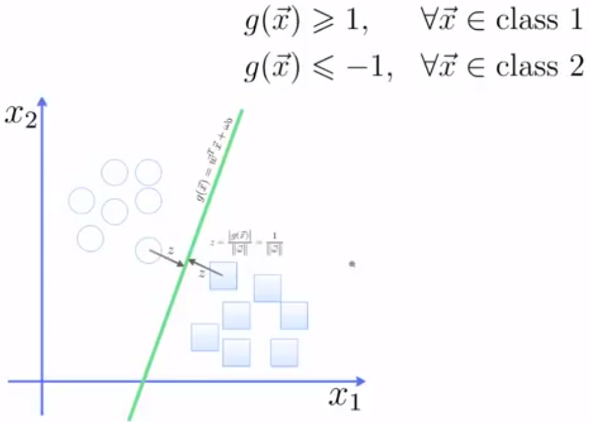 
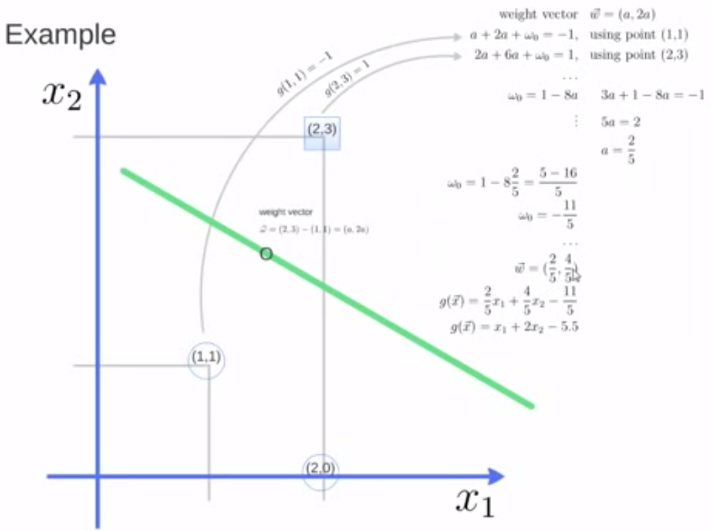 
          
          
***
***
##1 sklearn简单例子 

<pre>
from sklearn import svm

X = [[2, 0], [1, 1], [2,3]]
y = [0, 0, 1]
clf = svm.SVC(kernel = 'linear')
clf.fit(X, y)  

print clf

# get support vectors
print clf.support_vectors_

# get indices of support vectors
print clf.support_ 

# get number of support vectors for each class
print clf.n_support_ 

</pre>

##2 sklearn画出决定界限
<pre>
print(__doc__)

import numpy as np
import pylab as pl
from sklearn import svm

# we create 40 separable points
np.random.seed(0)
X = np.r_[np.random.randn(20, 2) - [2, 2], np.random.randn(20, 2) + [2, 2]]
Y = [0] * 20 + [1] * 20

# fit the model
clf = svm.SVC(kernel='linear')
clf.fit(X, Y)

# get the separating hyperplane
w = clf.coef_[0]
a = -w[0] / w[1]
xx = np.linspace(-5, 5)
yy = a * xx - (clf.intercept_[0]) / w[1]

# plot the parallels to the separating hyperplane that pass through the
# support vectors
b = clf.support_vectors_[0]
yy_down = a * xx + (b[1] - a * b[0])
b = clf.support_vectors_[-1]
yy_up = a * xx + (b[1] - a * b[0])

print "w: ", w
print "a: ", a
# print " xx: ", xx
# print " yy: ", yy
print "support_vectors_: ", clf.support_vectors_
print "clf.coef_: ", clf.coef_

# In scikit-learn coef_ attribute holds the vectors of the separating hyperplanes for linear models. It has shape (n_classes, n_features) if n_classes > 1 (multi-class one-vs-all) and (1, n_features) for binary classification.
# 
# In this toy binary classification example, n_features == 2, hence w = coef_[0] is the vector orthogonal to the hyperplane (the hyperplane is fully defined by it + the intercept).
# 
# To plot this hyperplane in the 2D case (any hyperplane of a 2D plane is a 1D line), we want to find a f as in y = f(x) = a.x + b. In this case a is the slope of the line and can be computed by a = -w[0] / w[1].

# plot the line, the points, and the nearest vectors to the plane
pl.plot(xx, yy, 'k-')
pl.plot(xx, yy_down, 'k--')
pl.plot(xx, yy_up, 'k--')

pl.scatter(clf.support_vectors_[:, 0], clf.support_vectors_[:, 1],
           s=80, facecolors='none')
pl.scatter(X[:, 0], X[:, 1], c=Y, cmap=pl.cm.Paired)

pl.axis('tight')
pl.show()

</pre>

##3 利用SVM进行人脸识别实例： 
<pre>

from __future__ import print_function

from time import time
import logging
import matplotlib.pyplot as plt

from sklearn.cross_validation import train_test_split
from sklearn.datasets import fetch_lfw_people
from sklearn.grid_search import GridSearchCV
from sklearn.metrics import classification_report
from sklearn.metrics import confusion_matrix
from sklearn.decomposition import RandomizedPCA
from sklearn.svm import SVC

print(__doc__)

# Display progress logs on stdout
logging.basicConfig(level=logging.INFO, format='%(asctime)s %(message)s')

###############################################################################
# Download the data, if not already on disk and load it as numpy arrays

lfw_people = fetch_lfw_people(min_faces_per_person=70, resize=0.4)

# introspect the images arrays to find the shapes (for plotting)
n_samples, h, w = lfw_people.images.shape

# for machine learning we use the 2 data directly (as relative pixel
# positions info is ignored by this model)
X = lfw_people.data
n_features = X.shape[1]

# the label to predict is the id of the person
y = lfw_people.target
target_names = lfw_people.target_names
n_classes = target_names.shape[0]

print("Total dataset size:")
print("n_samples: %d" % n_samples)
print("n_features: %d" % n_features)
print("n_classes: %d" % n_classes)

###############################################################################
# Split into a training set and a test set using a stratified k fold

# split into a training and testing set
X_train, X_test, y_train, y_test = train_test_split(
    X, y, test_size=0.25)

###############################################################################
# Compute a PCA (eigenfaces) on the face dataset (treated as unlabeled
# dataset): unsupervised feature extraction / dimensionality reduction
n_components = 150

print("Extracting the top %d eigenfaces from %d faces"
      % (n_components, X_train.shape[0]))
t0 = time()
pca = RandomizedPCA(n_components=n_components, whiten=True).fit(X_train)
print("done in %0.3fs" % (time() - t0))

eigenfaces = pca.components_.reshape((n_components, h, w))

print("Projecting the input data on the eigenfaces orthonormal basis")
t0 = time()
X_train_pca = pca.transform(X_train)
X_test_pca = pca.transform(X_test)
print("done in %0.3fs" % (time() - t0))

###############################################################################
# Train a SVM classification model

print("Fitting the classifier to the training set")
t0 = time()
param_grid = {'C': [1e3, 5e3, 1e4, 5e4, 1e5],
              'gamma': [0.0001, 0.0005, 0.001, 0.005, 0.01, 0.1], }
clf = GridSearchCV(SVC(kernel='rbf', class_weight='auto'), param_grid)
clf = clf.fit(X_train_pca, y_train)
print("done in %0.3fs" % (time() - t0))
print("Best estimator found by grid search:")
print(clf.best_estimator_)

###############################################################################
# Quantitative evaluation of the model quality on the test set

print("Predicting people's names on the test set")
t0 = time()
y_pred = clf.predict(X_test_pca)
print("done in %0.3fs" % (time() - t0))

print(classification_report(y_test, y_pred, target_names=target_names))
print(confusion_matrix(y_test, y_pred, labels=range(n_classes)))

###############################################################################
# Qualitative evaluation of the predictions using matplotlib

def plot_gallery(images, titles, h, w, n_row=3, n_col=4):
    """Helper function to plot a gallery of portraits"""
    plt.figure(figsize=(1.8 * n_col, 2.4 * n_row))
    plt.subplots_adjust(bottom=0, left=.01, right=.99, top=.90, hspace=.35)
    for i in range(n_row * n_col):
        plt.subplot(n_row, n_col, i + 1)
        plt.imshow(images[i].reshape((h, w)), cmap=plt.cm.gray)
        plt.title(titles[i], size=12)
        plt.xticks(())
        plt.yticks(())

# plot the result of the prediction on a portion of the test set

def title(y_pred, y_test, target_names, i):
    pred_name = target_names[y_pred[i]].rsplit(' ', 1)[-1]
    true_name = target_names[y_test[i]].rsplit(' ', 1)[-1]
    return 'predicted: %s\ntrue:      %s' % (pred_name, true_name)

prediction_titles = [title(y_pred, y_test, target_names, i)
                     for i in range(y_pred.shape[0])]

plot_gallery(X_test, prediction_titles, h, w)

# plot the gallery of the most significative eigenfaces

eigenface_titles = ["eigenface %d" % i for i in range(eigenfaces.shape[0])]
plot_gallery(eigenfaces, eigenface_titles, h, w)

plt.show()</pre> 

***
***

##1. 背景: 
     1.1 以人脑中的神经网络为启发，历史上出现过很多不同版本
     1.2 最著名的算法是1980年的 backpropagation 

##2. 多层向前神经网络(Multilayer Feed-Forward Neural Network)
     2.1 Backpropagation被使用在多层向前神经网络上
     2.2 多层向前神经网络由以下部分组成：
           输入层(input layer), 隐藏层 (hidden layers), 输入层 (output layers)

     2.3 每层由单元(units)组成
     2.4 输入层(input layer)是由训练集的实例特征向量传入
     2.5 经过连接结点的权重(weight)传入下一层，一层的输出是下一层的输入
     2.6 隐藏层的个数可以是任意的，输入层有一层，输出层有一层
     2.7 每个单元(unit)也可以被称作神经结点，根据生物学来源定义
     2.8 以上成为2层的神经网络（输入层不算）
     2.8 一层中加权的求和，然后根据非线性方程转化输出
     2.9 作为多层向前神经网络，理论上，如果有足够多的隐藏层(hidden layers) 和足够大的训练集, 可以模     
          拟出任何方程

##3. 设计神经网络结构
     3.1 使用神经网络训练数据之前，必须确定神经网络的层数，以及每层单元的个数
     3.2 特征向量在被传入输入层时通常被先标准化(normalize）到0和1之间 （为了加速学习过程）
     3.3 离散型变量可以被编码成每一个输入单元对应一个特征值可能赋的值
          比如：特征值A可能取三个值（a0, a1, a2), 可以使用3个输入单元来代表A。
                    如果A=a0, 那么代表a0的单元值就取1, 其他取0；
                    如果A=a1, 那么代表a1de单元值就取1，其他取0，以此类推

     3.4 神经网络即可以用来做分类(classification）问题，也可以解决回归(regression)问题
          3.4.1 对于分类问题，如果是2类，可以用一个输出单元表示（0和1分别代表2类）
                                         如果多余2类，每一个类别用一个输出单元表示
                   所以输入层的单元数量通常等于类别的数量

          3.4.2 没有明确的规则来设计最好有多少个隐藏层
                    3.4.2.1 根据实验测试和误差，以及准确度来实验并改进
                  
##4. 交叉验证方法(Cross-Validation)
          
                    

          K-fold cross validation 

##5. Backpropagation算法
     5.1 通过迭代性的来处理训练集中的实例
     5.2 对比经过神经网络后输入层预测值(predicted value)与真实值(target value)之间
     5.3 反方向（从输出层=>隐藏层=>输入层）来以最小化误差(error)来更新每个连接的权重(weight)
     5.4 算法详细介绍
           输入：D：数据集，l 学习率(learning rate)， 一个多层前向神经网络
           输入：一个训练好的神经网络(a trained neural network)

          5.4.1 初始化权重(weights)和偏向(bias): 随机初始化在-1到1之间，或者-0.5到0.5之间，每个单元有          
                    一个偏向
          5.4.2 对于每一个训练实例X，执行以下步骤：
                    5.4.2.1： 由输入层向前传送
                                   
   
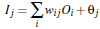 
      
                                    
                    
                                   

                                   
                      5.4.2.2 根据误差(error)反向传送
                                   对于输出层：

   
                                   对于隐藏层：
   

                                                      
                                   权重更新：
     
                                   偏向更新  
     
                                                     
               5.4.3 终止条件
                         5.4.3.1 权重的更新低于某个阈值
                         5.4.3.2 预测的错误率低于某个阈值
                         5.4.3.3 达到预设一定的循环次数
                         
##6. Backpropagation 算法举例
   
          
          
                                   对于输出层：
   
                                   对于隐藏层：
   
                                                       
                                   权重更新：
     
                                   偏向更新   
    

 
                                                     
***
##1. 关于非线性转化方程(non-linear transformation function) 

sigmoid函数(S 曲线)用来作为activation function:

     1.1 双曲函数(tanh)
     
     1.2  逻辑函数(logistic function)      
##2.实现一个简单的神经网络算法      
<pre>

import numpy as np

def tanh(x):  
    return np.tanh(x)

def tanh_deriv(x):  
    return 1.0 - np.tanh(x)*np.tanh(x)

def logistic(x):  
    return 1/(1 + np.exp(-x))

def logistic_derivative(x):  
    return logistic(x)*(1-logistic(x))

class NeuralNetwork:   
    def __init__(self, layers, activation='tanh'):  
        """  
        :param layers: A list containing the number of units in each layer.
        Should be at least two values  
        :param activation: The activation function to be used. Can be
        "logistic" or "tanh"  
        """  
        if activation == 'logistic':  
            self.activation = logistic  
            self.activation_deriv = logistic_derivative  
        elif activation == 'tanh':  
            self.activation = tanh  
            self.activation_deriv = tanh_deriv
    
        self.weights = []  
        for i in range(1, len(layers) - 1):  
            self.weights.append((2*np.random.random((layers[i - 1] + 1, layers[i] + 1))-1)*0.25)  
            self.weights.append((2*np.random.random((layers[i] + 1, layers[i + 1]))-1)*0.25)
            
            
    def fit(self, X, y, learning_rate=0.2, epochs=10000):         
        X = np.atleast_2d(X)         
        temp = np.ones([X.shape[0], X.shape[1]+1])         
        temp[:, 0:-1] = X  # adding the bias unit to the input layer         
        X = temp         
        y = np.array(y)
    
        for k in range(epochs):  
            i = np.random.randint(X.shape[0])  
            a = [X[i]]
    
            for l in range(len(self.weights)):  #going forward network, for each layer
                a.append(self.activation(np.dot(a[l], self.weights[l])))  #Computer the node value for each layer (O_i) using activation function
            error = y[i] - a[-1]  #Computer the error at the top layer
            deltas = [error * self.activation_deriv(a[-1])] #For output layer, Err calculation (delta is updated error)
            
            #Staring backprobagation
            for l in range(len(a) - 2, 0, -1): # we need to begin at the second to last layer 
                #Compute the updated error (i,e, deltas) for each node going from top layer to input layer 
                deltas.append(deltas[-1].dot(self.weights[l].T)*self.activation_deriv(a[l]))  
            deltas.reverse()  
            for i in range(len(self.weights)):  
                layer = np.atleast_2d(a[i])  
                delta = np.atleast_2d(deltas[i])  
                self.weights[i] += learning_rate * layer.T.dot(delta)
                
                
    def predict(self, x):         
        x = np.array(x)         
        temp = np.ones(x.shape[0]+1)         
        temp[0:-1] = x         
        a = temp         
        for l in range(0, len(self.weights)):             
            a = self.activation(np.dot(a, self.weights[l]))         
        return a

</pre>

***
##1. 简单非线性关系数据集测试(XOR): 

X:                  Y  
0 0                 0  
0 1                 1  
1 0                 1  
1 1                 0

Code:
<pre>

from NeuralNetwork import NeuralNetwork
import numpy as np

nn = NeuralNetwork([2,2,1], 'tanh')     
X = np.array([[0, 0], [0, 1], [1, 0], [1, 1]])     
y = np.array([0, 1, 1, 0])     
nn.fit(X, y)     
for i in [[0, 0], [0, 1], [1, 0], [1,1]]:    
    print(i, nn.predict(i))
</pre>

##2. 手写数字识别：

每个图片8x8 
识别数字：0,1,2,3,4,5,6,7,8,9

Code:

<pre>
import numpy as np 
from sklearn.datasets import load_digits 
from sklearn.metrics import confusion_matrix, classification_report 
from sklearn.preprocessing import LabelBinarizer 
from NeuralNetwork import NeuralNetwork
from sklearn.cross_validation import train_test_split

digits = load_digits()  
X = digits.data  
y = digits.target  
X -= X.min() # normalize the values to bring them into the range 0-1  
X /= X.max()

nn = NeuralNetwork([64,100,10],'logistic')  
X_train, X_test, y_train, y_test = train_test_split(X, y)  
labels_train = LabelBinarizer().fit_transform(y_train)  
labels_test = LabelBinarizer().fit_transform(y_test)
print "start fitting"
nn.fit(X_train,labels_train,epochs=3000)  
predictions = []  
for i in range(X_test.shape[0]):  
    o = nn.predict(X_test[i] )  
    predictions.append(np.argmax(o))  
print confusion_matrix(y_test,predictions)  
print classification_report(y_test,predictions)   
</pre>

***
***
##0. 前提介绍：

为什么需要统计量？

统计量：描述数据特征

0.1 集中趋势衡量

0.1.1均值（平均数，平均值）（mean）

{6, 2, 9, 1, 2}

(6 + 2 + 9 + 1 + 2) / 5 = 20 / 5 = 4

0.1.2中位数 （median）: 将数据中的各个数值按照大小顺序排列，居于中间位置的变量

0.1.2.1. 给数据排序：1， 2， 2， 6， 9
0.1.2.2. 找出位置处于中间的变量：2
    当n为基数的时候：直接取位置处于中间的变量
    当n为偶数的时候，取中间两个量的平均值

0.1.2众数 （mode）：数据中出现次数最多的数

0.2

0.2.1. 离散程度衡量

0.2.1.1方差（variance)

{6, 2, 9, 1, 2}

(1) (6 - 4)^2 + (2 - 4) ^2 + (9 - 4)^2 + (1 - 4)^2 + (2 - 4)^2 
   = 4 + 4 + 25 + 9 + 4
   = 46

(2) n - 1 = 5 - 1 = 4

(3) 46 / 4 = 11.5

0.2.1.2标准差 (standard deviation)

s = sqrt(11.5) = 3.39

##1. 介绍：回归(regression) Y变量为连续数值型(continuous numerical variable)
                    如：房价，人数，降雨量
             分类(Classification): Y变量为类别型(categorical variable)
                    如：颜色类别，电脑品牌，有无信誉
     
##2. 简单线性回归(Simple Linear Regression) 
     2.1 很多做决定过过程通常是根据两个或者多个变量之间的关系
     2.3 回归分析(regression analysis)用来建立方程模拟两个或者多个变量之间如何关联
     2.4 被预测的变量叫做：因变量(dependent variable), y, 输出(output)
     2.5 被用来进行预测的变量叫做： 自变量(independent variable), x, 输入(input)

##3. 简单线性回归介绍
     3.1 简单线性回归包含一个自变量(x)和一个因变量(y)
     3.2 以上两个变量的关系用一条直线来模拟
     3.3 如果包含两个以上的自变量，则称作多元回归分析(multiple regression)

##4. 简单线性回归模型
     4.1 被用来描述因变量(y)和自变量(X)以及偏差(error)之间关系的方程叫做回归模型
     4.2 简单线性回归的模型是:

              
          其中：              参数                   偏差

##5. 简单线性回归方程
                         E(y) = β0+β1x 
         这个方程对应的图像是一条直线，称作回归线
         其中，β0是回归线的截距
                  β1是回归线的斜率  
                  E(y)是在一个给定x值下y的期望值（均值）

##6. 正向线性关系：
               

     
##7. 负向线性关系：

##  8. 无关系

##9. 估计的简单线性回归方程
          ŷ=b0+b1x
     这个方程叫做估计线性方程(estimated regression line)
     其中，b0是估计线性方程的纵截距
               b1是估计线性方程的斜率
               ŷ是在自变量x等于一个给定值的时候，y的估计值

##10. 线性回归分析流程：
     

##11. 关于偏差ε的假定
     11.1 是一个随机的变量，均值为0
     11.2 ε的方差(variance)对于所有的自变量x是一样的
     11.3 ε的值是独立的
     11.4 ε满足正态分布

***
##1. 简单线性回归模型举例： 

汽车卖家做电视广告数量与卖出的汽车数量：
  

1.1 如何练处适合简单线性回归模型的最佳回归线？
  
  

使sum of squares最小

1.1.2 计算
  

分子 = (1-2)(14-20)+(3-2)(24-20)+(2-2)(18-20)+(1-2)(17-20)+(3-2)(27-20)
      = 6 + 4 + 0 + 3 + 7
      = 20

分母 = （1-2）^2 + (3-2)^2 + (2-2)^2 + (1-2)^2 + (3-2)^2
       = 1 + 1 + 0 + 1 + 1
       4

b1 = 20/4  =5

  

b0 = 20 - 5*2 = 20 - 10 = 10

  

1.2 预测：

假设有一周广告数量为6，预测的汽车销售量是多少？
  

x_given = 6

Y_hat = 5*6 + 10 = 40

1.3 Python实现：

<pre>
import numpy as np

def fitSLR(x, y):
    n = len(x)
    dinominator = 0
    numerator = 0
    for i in range(0, n):
        numerator += (x[i] - np.mean(x))*(y[i] - np.mean(y))
        dinominator += (x[i] - np.mean(x))**2
    b1 = numerator/float(dinominator)
    b0 = np.mean(y)/float(np.mean(x))
    return b0, b1

def predict(x, b0, b1):
    return b0 + x*b1

x = [1, 3, 2, 1, 3]
y = [14, 24, 18, 17, 27]    

b0, b1 = fitSLR(x, y)

print "intercept:", b0, " slope:", b1

x_test = 6

y_test = predict(6, b0, b1)

print "y_test:", y_test

</pre>

 ****
***
##1. 与简单线性回归区别(simple linear regression)
          多个自变量(x)

##2. 多元回归模型
     y=β0＋β１x1+β2x2+ ... +βpxp+ε
    其中：β0，β１，β2... βp是参数
                 ε是误差值

##3. 多元回归方程
     E(y)=β0＋β１x1+β2x2+ ... +βpxp

##4. 估计多元回归方程:
     y_hat=b0＋b１x1+b2x2+ ... +bpxp

    一个样本被用来计算β0，β１，β2... βp的点估计b0, b1, b2,..., bp

##5. 估计流程  (与简单线性回归类似）

##6. 估计方法
    使sum of squares最小    
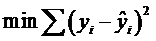     
    运算与简单线性回归类似，涉及到线性代数和矩阵代数的运算

##7. 例子

    一家快递公司送货：X1： 运输里程 X2： 运输次数   Y：总运输时间
<table style="border-collapse:collapse; width:442.8000pt; mso-table-layout-alt:fixed; mso-padding-alt:0.0000pt 5.4000pt 0.0000pt 5.4000pt ;"><tbody><tr><td width="147" valign="top" style="width:110.7000pt; padding:0.0000pt 5.4000pt 0.0000pt 5.4000pt ; border-left:1.0000pt solid rgb(0,0,0); mso-border-left-alt:1.0000pt solid rgb(0,0,0); border-top:1.0000pt solid rgb(0,0,0); mso-border-top-alt:1.0000pt solid rgb(0,0,0); background:rgb(0,0,0);">
Driving&nbsp;

Assignment
</td><td width="147" valign="top" style="width:110.7000pt; padding:0.0000pt 5.4000pt 0.0000pt 5.4000pt ; border-top:1.0000pt solid rgb(0,0,0); mso-border-top-alt:1.0000pt solid rgb(0,0,0); background:rgb(0,0,0);">
X1=Miles&nbsp;

Traveled
</td><td width="147" valign="top" style="width:110.7000pt; padding:0.0000pt 5.4000pt 0.0000pt 5.4000pt ; border-top:1.0000pt solid rgb(0,0,0); mso-border-top-alt:1.0000pt solid rgb(0,0,0); background:rgb(0,0,0);">
X2=Number&nbsp;of&nbsp;Deliveries
</td><td width="147" valign="top" style="width:110.7000pt; padding:0.0000pt 5.4000pt 0.0000pt 5.4000pt ; border-right:1.0000pt solid rgb(0,0,0); mso-border-right-alt:1.0000pt solid rgb(0,0,0); border-top:1.0000pt solid rgb(0,0,0); mso-border-top-alt:1.0000pt solid rgb(0,0,0); background:rgb(0,0,0);">
Y=&nbsp;Travel&nbsp;Time&nbsp;(Hours)
</td></tr><tr><td width="147" valign="top" style="width:110.7000pt; padding:0.0000pt 5.4000pt 0.0000pt 5.4000pt ; border-left:1.0000pt solid rgb(0,0,0); mso-border-left-alt:1.0000pt solid rgb(0,0,0); border-top:none; ; mso-border-top-alt:1.0000pt solid rgb(0,0,0); border-bottom:1.0000pt solid rgb(0,0,0); mso-border-bottom-alt:1.0000pt solid rgb(0,0,0);">
1
</td><td width="147" valign="top" style="width:110.7000pt; padding:0.0000pt 5.4000pt 0.0000pt 5.4000pt ; border-top:none; ; mso-border-top-alt:1.0000pt solid rgb(0,0,0); border-bottom:1.0000pt solid rgb(0,0,0); mso-border-bottom-alt:1.0000pt solid rgb(0,0,0);">
100
</td><td width="147" valign="top" style="width:110.7000pt; padding:0.0000pt 5.4000pt 0.0000pt 5.4000pt ; border-top:none; ; mso-border-top-alt:1.0000pt solid rgb(0,0,0); border-bottom:1.0000pt solid rgb(0,0,0); mso-border-bottom-alt:1.0000pt solid rgb(0,0,0);">
4
</td><td width="147" valign="top" style="width:110.7000pt; padding:0.0000pt 5.4000pt 0.0000pt 5.4000pt ; border-right:1.0000pt solid rgb(0,0,0); mso-border-right-alt:1.0000pt solid rgb(0,0,0); border-top:none; ; mso-border-top-alt:1.0000pt solid rgb(0,0,0); border-bottom:1.0000pt solid rgb(0,0,0); mso-border-bottom-alt:1.0000pt solid rgb(0,0,0);">
9.3
</td></tr><tr><td width="147" valign="top" style="width:110.7000pt; padding:0.0000pt 5.4000pt 0.0000pt 5.4000pt ; border-left:1.0000pt solid rgb(0,0,0); mso-border-left-alt:1.0000pt solid rgb(0,0,0);">
2
</td><td width="147" valign="top" style="width:110.7000pt; padding:0.0000pt 5.4000pt 0.0000pt 5.4000pt ;">
50
</td><td width="147" valign="top" style="width:110.7000pt; padding:0.0000pt 5.4000pt 0.0000pt 5.4000pt ;">
3
</td><td width="147" valign="top" style="width:110.7000pt; padding:0.0000pt 5.4000pt 0.0000pt 5.4000pt ; border-right:1.0000pt solid rgb(0,0,0); mso-border-right-alt:1.0000pt solid rgb(0,0,0);">
4.8
</td></tr><tr><td width="147" valign="top" style="width:110.7000pt; padding:0.0000pt 5.4000pt 0.0000pt 5.4000pt ; border-left:1.0000pt solid rgb(0,0,0); mso-border-left-alt:1.0000pt solid rgb(0,0,0); border-top:none; ; mso-border-top-alt:1.0000pt solid rgb(0,0,0); border-bottom:1.0000pt solid rgb(0,0,0); mso-border-bottom-alt:1.0000pt solid rgb(0,0,0);">
3
</td><td width="147" valign="top" style="width:110.7000pt; padding:0.0000pt 5.4000pt 0.0000pt 5.4000pt ; border-top:none; ; mso-border-top-alt:1.0000pt solid rgb(0,0,0); border-bottom:1.0000pt solid rgb(0,0,0); mso-border-bottom-alt:1.0000pt solid rgb(0,0,0);">
100
</td><td width="147" valign="top" style="width:110.7000pt; padding:0.0000pt 5.4000pt 0.0000pt 5.4000pt ; border-top:none; ; mso-border-top-alt:1.0000pt solid rgb(0,0,0); border-bottom:1.0000pt solid rgb(0,0,0); mso-border-bottom-alt:1.0000pt solid rgb(0,0,0);">
4
</td><td width="147" valign="top" style="width:110.7000pt; padding:0.0000pt 5.4000pt 0.0000pt 5.4000pt ; border-right:1.0000pt solid rgb(0,0,0); mso-border-right-alt:1.0000pt solid rgb(0,0,0); border-top:none; ; mso-border-top-alt:1.0000pt solid rgb(0,0,0); border-bottom:1.0000pt solid rgb(0,0,0); mso-border-bottom-alt:1.0000pt solid rgb(0,0,0);">
8.9
</td></tr><tr><td width="147" valign="top" style="width:110.7000pt; padding:0.0000pt 5.4000pt 0.0000pt 5.4000pt ; border-left:1.0000pt solid rgb(0,0,0); mso-border-left-alt:1.0000pt solid rgb(0,0,0);">
4
</td><td width="147" valign="top" style="width:110.7000pt; padding:0.0000pt 5.4000pt 0.0000pt 5.4000pt ;">
100
</td><td width="147" valign="top" style="width:110.7000pt; padding:0.0000pt 5.4000pt 0.0000pt 5.4000pt ;">
2
</td><td width="147" valign="top" style="width:110.7000pt; padding:0.0000pt 5.4000pt 0.0000pt 5.4000pt ; border-right:1.0000pt solid rgb(0,0,0); mso-border-right-alt:1.0000pt solid rgb(0,0,0);">
6.5
</td></tr><tr><td width="147" valign="top" style="width:110.7000pt; padding:0.0000pt 5.4000pt 0.0000pt 5.4000pt ; border-left:1.0000pt solid rgb(0,0,0); mso-border-left-alt:1.0000pt solid rgb(0,0,0); border-top:none; ; mso-border-top-alt:1.0000pt solid rgb(0,0,0); border-bottom:1.0000pt solid rgb(0,0,0); mso-border-bottom-alt:1.0000pt solid rgb(0,0,0);">
5
</td><td width="147" valign="top" style="width:110.7000pt; padding:0.0000pt 5.4000pt 0.0000pt 5.4000pt ; border-top:none; ; mso-border-top-alt:1.0000pt solid rgb(0,0,0); border-bottom:1.0000pt solid rgb(0,0,0); mso-border-bottom-alt:1.0000pt solid rgb(0,0,0);">
50
</td><td width="147" valign="top" style="width:110.7000pt; padding:0.0000pt 5.4000pt 0.0000pt 5.4000pt ; border-top:none; ; mso-border-top-alt:1.0000pt solid rgb(0,0,0); border-bottom:1.0000pt solid rgb(0,0,0); mso-border-bottom-alt:1.0000pt solid rgb(0,0,0);">
2
</td><td width="147" valign="top" style="width:110.7000pt; padding:0.0000pt 5.4000pt 0.0000pt 5.4000pt ; border-right:1.0000pt solid rgb(0,0,0); mso-border-right-alt:1.0000pt solid rgb(0,0,0); border-top:none; ; mso-border-top-alt:1.0000pt solid rgb(0,0,0); border-bottom:1.0000pt solid rgb(0,0,0); mso-border-bottom-alt:1.0000pt solid rgb(0,0,0);">
4.2
</td></tr><tr><td width="147" valign="top" style="width:110.7000pt; padding:0.0000pt 5.4000pt 0.0000pt 5.4000pt ; border-left:1.0000pt solid rgb(0,0,0); mso-border-left-alt:1.0000pt solid rgb(0,0,0);">
6
</td><td width="147" valign="top" style="width:110.7000pt; padding:0.0000pt 5.4000pt 0.0000pt 5.4000pt ;">
80
</td><td width="147" valign="top" style="width:110.7000pt; padding:0.0000pt 5.4000pt 0.0000pt 5.4000pt ;">
2
</td><td width="147" valign="top" style="width:110.7000pt; padding:0.0000pt 5.4000pt 0.0000pt 5.4000pt ; border-right:1.0000pt solid rgb(0,0,0); mso-border-right-alt:1.0000pt solid rgb(0,0,0);">
6.2
</td></tr><tr><td width="147" valign="top" style="width:110.7000pt; padding:0.0000pt 5.4000pt 0.0000pt 5.4000pt ; border-left:1.0000pt solid rgb(0,0,0); mso-border-left-alt:1.0000pt solid rgb(0,0,0); border-top:none; ; mso-border-top-alt:1.0000pt solid rgb(0,0,0); border-bottom:1.0000pt solid rgb(0,0,0); mso-border-bottom-alt:1.0000pt solid rgb(0,0,0);">
7
</td><td width="147" valign="top" style="width:110.7000pt; padding:0.0000pt 5.4000pt 0.0000pt 5.4000pt ; border-top:none; ; mso-border-top-alt:1.0000pt solid rgb(0,0,0); border-bottom:1.0000pt solid rgb(0,0,0); mso-border-bottom-alt:1.0000pt solid rgb(0,0,0);">
75
</td><td width="147" valign="top" style="width:110.7000pt; padding:0.0000pt 5.4000pt 0.0000pt 5.4000pt ; border-top:none; ; mso-border-top-alt:1.0000pt solid rgb(0,0,0); border-bottom:1.0000pt solid rgb(0,0,0); mso-border-bottom-alt:1.0000pt solid rgb(0,0,0);">
3
</td><td width="147" valign="top" style="width:110.7000pt; padding:0.0000pt 5.4000pt 0.0000pt 5.4000pt ; border-right:1.0000pt solid rgb(0,0,0); mso-border-right-alt:1.0000pt solid rgb(0,0,0); border-top:none; ; mso-border-top-alt:1.0000pt solid rgb(0,0,0); border-bottom:1.0000pt solid rgb(0,0,0); mso-border-bottom-alt:1.0000pt solid rgb(0,0,0);">
7.4
</td></tr><tr><td width="147" valign="top" style="width:110.7000pt; padding:0.0000pt 5.4000pt 0.0000pt 5.4000pt ; border-left:1.0000pt solid rgb(0,0,0); mso-border-left-alt:1.0000pt solid rgb(0,0,0);">
8
</td><td width="147" valign="top" style="width:110.7000pt; padding:0.0000pt 5.4000pt 0.0000pt 5.4000pt ;">
65
</td><td width="147" valign="top" style="width:110.7000pt; padding:0.0000pt 5.4000pt 0.0000pt 5.4000pt ;">
4
</td><td width="147" valign="top" style="width:110.7000pt; padding:0.0000pt 5.4000pt 0.0000pt 5.4000pt ; border-right:1.0000pt solid rgb(0,0,0); mso-border-right-alt:1.0000pt solid rgb(0,0,0);">
6.0
</td></tr><tr><td width="147" valign="top" style="width:110.7000pt; padding:0.0000pt 5.4000pt 0.0000pt 5.4000pt ; border-left:1.0000pt solid rgb(0,0,0); mso-border-left-alt:1.0000pt solid rgb(0,0,0); border-top:none; ; mso-border-top-alt:1.0000pt solid rgb(0,0,0); border-bottom:1.0000pt solid rgb(0,0,0); mso-border-bottom-alt:1.0000pt solid rgb(0,0,0);">
9
</td><td width="147" valign="top" style="width:110.7000pt; padding:0.0000pt 5.4000pt 0.0000pt 5.4000pt ; border-top:none; ; mso-border-top-alt:1.0000pt solid rgb(0,0,0); border-bottom:1.0000pt solid rgb(0,0,0); mso-border-bottom-alt:1.0000pt solid rgb(0,0,0);">
90
</td><td width="147" valign="top" style="width:110.7000pt; padding:0.0000pt 5.4000pt 0.0000pt 5.4000pt ; border-top:none; ; mso-border-top-alt:1.0000pt solid rgb(0,0,0); border-bottom:1.0000pt solid rgb(0,0,0); mso-border-bottom-alt:1.0000pt solid rgb(0,0,0);">
3
</td><td width="147" valign="top" style="width:110.7000pt; padding:0.0000pt 5.4000pt 0.0000pt 5.4000pt ; border-right:1.0000pt solid rgb(0,0,0); mso-border-right-alt:1.0000pt solid rgb(0,0,0); border-top:none; ; mso-border-top-alt:1.0000pt solid rgb(0,0,0); border-bottom:1.0000pt solid rgb(0,0,0); mso-border-bottom-alt:1.0000pt solid rgb(0,0,0);">
7.6
</td></tr><tr><td width="147" valign="top" style="width:110.7000pt; padding:0.0000pt 5.4000pt 0.0000pt 5.4000pt ; border-left:1.0000pt solid rgb(0,0,0); mso-border-left-alt:1.0000pt solid rgb(0,0,0); border-bottom:1.0000pt solid rgb(0,0,0); mso-border-bottom-alt:1.0000pt solid rgb(0,0,0);">
10
</td><td width="147" valign="top" style="width:110.7000pt; padding:0.0000pt 5.4000pt 0.0000pt 5.4000pt ; border-bottom:1.0000pt solid rgb(0,0,0); mso-border-bottom-alt:1.0000pt solid rgb(0,0,0);">
90
</td><td width="147" valign="top" style="width:110.7000pt; padding:0.0000pt 5.4000pt 0.0000pt 5.4000pt ; border-bottom:1.0000pt solid rgb(0,0,0); mso-border-bottom-alt:1.0000pt solid rgb(0,0,0);">
2
</td><td width="147" valign="top" style="width:110.7000pt; padding:0.0000pt 5.4000pt 0.0000pt 5.4000pt ; border-right:1.0000pt solid rgb(0,0,0); mso-border-right-alt:1.0000pt solid rgb(0,0,0); border-bottom:1.0000pt solid rgb(0,0,0); mso-border-bottom-alt:1.0000pt solid rgb(0,0,0);">
6.1
</td></tr></tbody></table>

Time = b0+ b1*Miles + b2 * Deliveries 
     

Time = -0.869 + 0.0611 Miles + 0.923 Deliveries 

##8. 描述参数含义
     b0: 平均每多运送一英里，运输时间延长0.0611 小时
     b1: 平均每多一次运输，运输时间延长 0.923 小时

##9. 预测

     如果一个运输任务是跑102英里，运输6次，预计多少小时？

     Time = -0.869 +0.0611 *102+ 0.923 * 6
              = 10.9 (小时）

##10. 如果自变量中有分类型变量(categorical data) , 如何处理？

<table width="288" style="border-collapse:collapse;width:216.00pt;"><colgroup><col width="72"><col width="72"><col width="72"><col width="72"></colgroup><tbody><tr><td width="72" height="19" style="font-size: 12pt; vertical-align: middle; height: 14.25pt; width: 54pt;">英里数</td><td width="72" height="19" style="font-size: 12pt; vertical-align: middle; height: 14.25pt; width: 54pt;">次数</td><td width="72" height="19" style="font-size: 12pt; vertical-align: middle; height: 14.25pt; width: 54pt;">车型</td><td width="72" height="19" style="font-size: 12pt; vertical-align: middle; height: 14.25pt; width: 54pt;">时间</td></tr><tr><td width="72" height="19" style="font-size: 12pt; vertical-align: middle; height: 14.25pt; width: 54pt;">100</td><td width="72" height="19" style="font-size: 12pt; vertical-align: middle; height: 14.25pt; width: 54pt;">4</td><td width="72" height="19" style="font-size: 12pt; vertical-align: middle; height: 14.25pt; width: 54pt;">1</td><td width="72" height="19" style="font-size: 12pt; vertical-align: middle; height: 14.25pt; width: 54pt;">9.3</td></tr><tr><td width="72" height="19" style="font-size: 12pt; vertical-align: middle; height: 14.25pt; width: 54pt;">50</td><td width="72" height="19" style="font-size: 12pt; vertical-align: middle; height: 14.25pt; width: 54pt;">3</td><td width="72" height="19" style="font-size: 12pt; vertical-align: middle; height: 14.25pt; width: 54pt;">0</td><td width="72" height="19" style="font-size: 12pt; vertical-align: middle; height: 14.25pt; width: 54pt;">4.8</td></tr><tr><td width="72" height="19" style="font-size: 12pt; vertical-align: middle; height: 14.25pt; width: 54pt;">100</td><td width="72" height="19" style="font-size: 12pt; vertical-align: middle; height: 14.25pt; width: 54pt;">4</td><td width="72" height="19" style="font-size: 12pt; vertical-align: middle; height: 14.25pt; width: 54pt;">1</td><td width="72" height="19" style="font-size: 12pt; vertical-align: middle; height: 14.25pt; width: 54pt;">8.9</td></tr><tr><td width="72" height="19" style="font-size: 12pt; vertical-align: middle; height: 14.25pt; width: 54pt;">100</td><td width="72" height="19" style="font-size: 12pt; vertical-align: middle; height: 14.25pt; width: 54pt;">2</td><td width="72" height="19" style="font-size: 12pt; vertical-align: middle; height: 14.25pt; width: 54pt;">2</td><td width="72" height="19" style="font-size: 12pt; vertical-align: middle; height: 14.25pt; width: 54pt;">6.5</td></tr><tr><td width="72" height="19" style="font-size: 12pt; vertical-align: middle; height: 14.25pt; width: 54pt;">50</td><td width="72" height="19" style="font-size: 12pt; vertical-align: middle; height: 14.25pt; width: 54pt;">2</td><td width="72" height="19" style="font-size: 12pt; vertical-align: middle; height: 14.25pt; width: 54pt;">2</td><td width="72" height="19" style="font-size: 12pt; vertical-align: middle; height: 14.25pt; width: 54pt;">4.2</td></tr><tr><td width="72" height="19" style="font-size: 12pt; vertical-align: middle; height: 14.25pt; width: 54pt;">80</td><td width="72" height="19" style="font-size: 12pt; vertical-align: middle; height: 14.25pt; width: 54pt;">2</td><td width="72" height="19" style="font-size: 12pt; vertical-align: middle; height: 14.25pt; width: 54pt;">1</td><td width="72" height="19" style="font-size: 12pt; vertical-align: middle; height: 14.25pt; width: 54pt;">6.2</td></tr><tr><td width="72" height="19" style="font-size: 12pt; vertical-align: middle; height: 14.25pt; width: 54pt;">75</td><td width="72" height="19" style="font-size: 12pt; vertical-align: middle; height: 14.25pt; width: 54pt;">3</td><td width="72" height="19" style="font-size: 12pt; vertical-align: middle; height: 14.25pt; width: 54pt;">1</td><td width="72" height="19" style="font-size: 12pt; vertical-align: middle; height: 14.25pt; width: 54pt;">7.4</td></tr><tr><td width="72" height="19" style="font-size: 12pt; vertical-align: middle; height: 14.25pt; width: 54pt;">65</td><td width="72" height="19" style="font-size: 12pt; vertical-align: middle; height: 14.25pt; width: 54pt;">4</td><td width="72" height="19" style="font-size: 12pt; vertical-align: middle; height: 14.25pt; width: 54pt;">0</td><td width="72" height="19" style="font-size: 12pt; vertical-align: middle; height: 14.25pt; width: 54pt;">6</td></tr><tr><td width="72" height="19" style="font-size: 12pt; vertical-align: middle; height: 14.25pt; width: 54pt;">90</td><td width="72" height="19" style="font-size: 12pt; vertical-align: middle; height: 14.25pt; width: 54pt;">3</td><td width="72" height="19" style="font-size: 12pt; vertical-align: middle; height: 14.25pt; width: 54pt;">0</td><td width="72" height="19" style="font-size: 12pt; vertical-align: middle; height: 14.25pt; width: 54pt;">7.6</td></tr></tbody></table>

##11. 关于误差的分布

误差ε是一个随机变量，均值为0
ε的方差对于所有的自变量来说相等
所有ε的值是独立的
ε满足正态分布，并且通过β0＋β１x1+β2x2+ ... +βpxp反映y的期望值
***

##1. 例子 

    一家快递公司送货：X1： 运输里程 X2： 运输次数   Y：总运输时间
<table style="border-collapse: collapse; width: 442.8pt;"><tbody><tr><td width="147" valign="top" style="width: 110.7pt; padding: 0pt 5.4pt; border-left-width: 1pt; border-left-style: solid; border-left-color: rgb(0, 0, 0); border-top-width: 1pt; border-top-style: solid; border-top-color: rgb(0, 0, 0); background-color: rgb(0, 0, 0); background-position: initial initial; background-repeat: initial initial;">
Driving&nbsp;

Assignment
</td><td width="147" valign="top" style="width: 110.7pt; padding: 0pt 5.4pt; border-top-width: 1pt; border-top-style: solid; border-top-color: rgb(0, 0, 0); background-color: rgb(0, 0, 0); background-position: initial initial; background-repeat: initial initial;">
X1=Miles&nbsp;

Traveled
</td><td width="147" valign="top" style="width: 110.7pt; padding: 0pt 5.4pt; border-top-width: 1pt; border-top-style: solid; border-top-color: rgb(0, 0, 0); background-color: rgb(0, 0, 0); background-position: initial initial; background-repeat: initial initial;">
X2=Number&nbsp;of&nbsp;Deliveries
</td><td width="147" valign="top" style="width: 110.7pt; padding: 0pt 5.4pt; border-right-width: 1pt; border-right-style: solid; border-right-color: rgb(0, 0, 0); border-top-width: 1pt; border-top-style: solid; border-top-color: rgb(0, 0, 0); background-color: rgb(0, 0, 0); background-position: initial initial; background-repeat: initial initial;">
Y=&nbsp;Travel&nbsp;Time&nbsp;(Hours)
</td></tr><tr><td width="147" valign="top" style="width: 110.7pt; padding: 0pt 5.4pt; border-left-width: 1pt; border-left-style: solid; border-left-color: rgb(0, 0, 0); border-top-style: none; border-bottom-width: 1pt; border-bottom-style: solid; border-bottom-color: rgb(0, 0, 0);">
1
</td><td width="147" valign="top" style="width: 110.7pt; padding: 0pt 5.4pt; border-top-style: none; border-bottom-width: 1pt; border-bottom-style: solid; border-bottom-color: rgb(0, 0, 0);">
100
</td><td width="147" valign="top" style="width: 110.7pt; padding: 0pt 5.4pt; border-top-style: none; border-bottom-width: 1pt; border-bottom-style: solid; border-bottom-color: rgb(0, 0, 0);">
4
</td><td width="147" valign="top" style="width: 110.7pt; padding: 0pt 5.4pt; border-right-width: 1pt; border-right-style: solid; border-right-color: rgb(0, 0, 0); border-top-style: none; border-bottom-width: 1pt; border-bottom-style: solid; border-bottom-color: rgb(0, 0, 0);">
9.3
</td></tr><tr><td width="147" valign="top" style="width: 110.7pt; padding: 0pt 5.4pt; border-left-width: 1pt; border-left-style: solid; border-left-color: rgb(0, 0, 0);">
2
</td><td width="147" valign="top" style="width: 110.7pt; padding: 0pt 5.4pt;">
50
</td><td width="147" valign="top" style="width: 110.7pt; padding: 0pt 5.4pt;">
3
</td><td width="147" valign="top" style="width: 110.7pt; padding: 0pt 5.4pt; border-right-width: 1pt; border-right-style: solid; border-right-color: rgb(0, 0, 0);">
4.8
</td></tr><tr><td width="147" valign="top" style="width: 110.7pt; padding: 0pt 5.4pt; border-left-width: 1pt; border-left-style: solid; border-left-color: rgb(0, 0, 0); border-top-style: none; border-bottom-width: 1pt; border-bottom-style: solid; border-bottom-color: rgb(0, 0, 0);">
3
</td><td width="147" valign="top" style="width: 110.7pt; padding: 0pt 5.4pt; border-top-style: none; border-bottom-width: 1pt; border-bottom-style: solid; border-bottom-color: rgb(0, 0, 0);">
100
</td><td width="147" valign="top" style="width: 110.7pt; padding: 0pt 5.4pt; border-top-style: none; border-bottom-width: 1pt; border-bottom-style: solid; border-bottom-color: rgb(0, 0, 0);">
4
</td><td width="147" valign="top" style="width: 110.7pt; padding: 0pt 5.4pt; border-right-width: 1pt; border-right-style: solid; border-right-color: rgb(0, 0, 0); border-top-style: none; border-bottom-width: 1pt; border-bottom-style: solid; border-bottom-color: rgb(0, 0, 0);">
8.9
</td></tr><tr><td width="147" valign="top" style="width: 110.7pt; padding: 0pt 5.4pt; border-left-width: 1pt; border-left-style: solid; border-left-color: rgb(0, 0, 0);">
4
</td><td width="147" valign="top" style="width: 110.7pt; padding: 0pt 5.4pt;">
100
</td><td width="147" valign="top" style="width: 110.7pt; padding: 0pt 5.4pt;">
2
</td><td width="147" valign="top" style="width: 110.7pt; padding: 0pt 5.4pt; border-right-width: 1pt; border-right-style: solid; border-right-color: rgb(0, 0, 0);">
6.5
</td></tr><tr><td width="147" valign="top" style="width: 110.7pt; padding: 0pt 5.4pt; border-left-width: 1pt; border-left-style: solid; border-left-color: rgb(0, 0, 0); border-top-style: none; border-bottom-width: 1pt; border-bottom-style: solid; border-bottom-color: rgb(0, 0, 0);">
5
</td><td width="147" valign="top" style="width: 110.7pt; padding: 0pt 5.4pt; border-top-style: none; border-bottom-width: 1pt; border-bottom-style: solid; border-bottom-color: rgb(0, 0, 0);">
50
</td><td width="147" valign="top" style="width: 110.7pt; padding: 0pt 5.4pt; border-top-style: none; border-bottom-width: 1pt; border-bottom-style: solid; border-bottom-color: rgb(0, 0, 0);">
2
</td><td width="147" valign="top" style="width: 110.7pt; padding: 0pt 5.4pt; border-right-width: 1pt; border-right-style: solid; border-right-color: rgb(0, 0, 0); border-top-style: none; border-bottom-width: 1pt; border-bottom-style: solid; border-bottom-color: rgb(0, 0, 0);">
4.2
</td></tr><tr><td width="147" valign="top" style="width: 110.7pt; padding: 0pt 5.4pt; border-left-width: 1pt; border-left-style: solid; border-left-color: rgb(0, 0, 0);">
6
</td><td width="147" valign="top" style="width: 110.7pt; padding: 0pt 5.4pt;">
80
</td><td width="147" valign="top" style="width: 110.7pt; padding: 0pt 5.4pt;">
2
</td><td width="147" valign="top" style="width: 110.7pt; padding: 0pt 5.4pt; border-right-width: 1pt; border-right-style: solid; border-right-color: rgb(0, 0, 0);">
6.2
</td></tr><tr><td width="147" valign="top" style="width: 110.7pt; padding: 0pt 5.4pt; border-left-width: 1pt; border-left-style: solid; border-left-color: rgb(0, 0, 0); border-top-style: none; border-bottom-width: 1pt; border-bottom-style: solid; border-bottom-color: rgb(0, 0, 0);">
7
</td><td width="147" valign="top" style="width: 110.7pt; padding: 0pt 5.4pt; border-top-style: none; border-bottom-width: 1pt; border-bottom-style: solid; border-bottom-color: rgb(0, 0, 0);">
75
</td><td width="147" valign="top" style="width: 110.7pt; padding: 0pt 5.4pt; border-top-style: none; border-bottom-width: 1pt; border-bottom-style: solid; border-bottom-color: rgb(0, 0, 0);">
3
</td><td width="147" valign="top" style="width: 110.7pt; padding: 0pt 5.4pt; border-right-width: 1pt; border-right-style: solid; border-right-color: rgb(0, 0, 0); border-top-style: none; border-bottom-width: 1pt; border-bottom-style: solid; border-bottom-color: rgb(0, 0, 0);">
7.4
</td></tr><tr><td width="147" valign="top" style="width: 110.7pt; padding: 0pt 5.4pt; border-left-width: 1pt; border-left-style: solid; border-left-color: rgb(0, 0, 0);">
8
</td><td width="147" valign="top" style="width: 110.7pt; padding: 0pt 5.4pt;">
65
</td><td width="147" valign="top" style="width: 110.7pt; padding: 0pt 5.4pt;">
4
</td><td width="147" valign="top" style="width: 110.7pt; padding: 0pt 5.4pt; border-right-width: 1pt; border-right-style: solid; border-right-color: rgb(0, 0, 0);">
6.0
</td></tr><tr><td width="147" valign="top" style="width: 110.7pt; padding: 0pt 5.4pt; border-left-width: 1pt; border-left-style: solid; border-left-color: rgb(0, 0, 0); border-top-style: none; border-bottom-width: 1pt; border-bottom-style: solid; border-bottom-color: rgb(0, 0, 0);">
9
</td><td width="147" valign="top" style="width: 110.7pt; padding: 0pt 5.4pt; border-top-style: none; border-bottom-width: 1pt; border-bottom-style: solid; border-bottom-color: rgb(0, 0, 0);">
90
</td><td width="147" valign="top" style="width: 110.7pt; padding: 0pt 5.4pt; border-top-style: none; border-bottom-width: 1pt; border-bottom-style: solid; border-bottom-color: rgb(0, 0, 0);">
3
</td><td width="147" valign="top" style="width: 110.7pt; padding: 0pt 5.4pt; border-right-width: 1pt; border-right-style: solid; border-right-color: rgb(0, 0, 0); border-top-style: none; border-bottom-width: 1pt; border-bottom-style: solid; border-bottom-color: rgb(0, 0, 0);">
7.6
</td></tr><tr><td width="147" valign="top" style="width: 110.7pt; padding: 0pt 5.4pt; border-left-width: 1pt; border-left-style: solid; border-left-color: rgb(0, 0, 0); border-bottom-width: 1pt; border-bottom-style: solid; border-bottom-color: rgb(0, 0, 0);">
10
</td><td width="147" valign="top" style="width: 110.7pt; padding: 0pt 5.4pt; border-bottom-width: 1pt; border-bottom-style: solid; border-bottom-color: rgb(0, 0, 0);">
90
</td><td width="147" valign="top" style="width: 110.7pt; padding: 0pt 5.4pt; border-bottom-width: 1pt; border-bottom-style: solid; border-bottom-color: rgb(0, 0, 0);">
2
</td><td width="147" valign="top" style="width: 110.7pt; padding: 0pt 5.4pt; border-right-width: 1pt; border-right-style: solid; border-right-color: rgb(0, 0, 0); border-bottom-width: 1pt; border-bottom-style: solid; border-bottom-color: rgb(0, 0, 0);">
6.1
</td></tr></tbody></table>
 

目的，求出b0, b1,.... bp：

 y_hat=b0＋b１x1+b2x2+ ... +bpxp 

##2. Python代码：

<pre>
from numpy import genfromtxt
import numpy as np
from sklearn import datasets, linear_model

dataPath = r"D:\MaiziEdu\DeepLearningBasics_MachineLearning\Datasets\Delivery.csv"
deliveryData = genfromtxt(dataPath, delimiter=',')

print "data"
print deliveryData

X = deliveryData[:, :-1]
Y = deliveryData[:, -1]

print "X:"
print X
print "Y: "
print Y

regr = linear_model.LinearRegression()

regr.fit(X, Y)

print "coefficients"
print regr.coef_
print "intercept: "
print regr.intercept_

xPred = [102, 6]
yPred = regr.predict(xPred)
print "predicted y: "
print yPred
</pre>

***
***
##1. 概率： 

     1.1 定义   概率(P)robability: 对一件事情发生的可能性的衡量
     1.2 范围   0 <= P <= 1
     1.3 计算方法： 
          1.3.1 根据个人置信
          1.3.2 根据历史数据
          1.3.3 根据模拟数据
     1.4 条件概率：

                         
##2. Logistic Regression (逻辑回归)

     2.1 例子
                    
                                   h(x) > 0.5

 
               

                                             h(x) > 0.2

   	2.2 基本模型
         测试数据为X（x0，x1，x2···xn）
         要学习的参数为： Θ（θ0，θ1，θ2，···θn）
         
     
          向量表示：

 
          
     

          
        处理二值数据，引入Sigmoid函数时曲线平滑化 
          
      
     
          

          预测函数：
  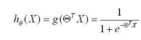                     

          用概率表示：
          正例(y=1)：
                   
                         
          反例(y=0):
                              
   
       2.3  Cost函数
              线性回归:
                    
   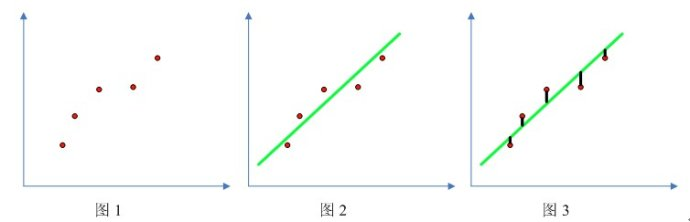 
 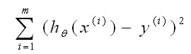 
               
     
          
          
           
            找到合适的 θ0，θ1使上式最小

          Logistic regression:

  

           Cost函数：
               

            目标：找到合适的 θ0，θ1使上式最小
             
          2.4 解法：梯度下降（gradient decent)

               
   
 

                      
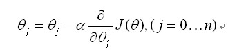 

         

              更新法则：
               
 
                      
	  学习率  
      同时对所有的θ进行更新  
      重复更新直到收敛   

##Python 实现： 
<pre>

import numpy as np
import random

# m denotes the number of examples here, not the number of features
def gradientDescent(x, y, theta, alpha, m, numIterations):
    xTrans = x.transpose()
    for i in range(0, numIterations):
        hypothesis = np.dot(x, theta)
        loss = hypothesis - y
        # avg cost per example (the 2 in 2*m doesn't really matter here.
        # But to be consistent with the gradient, I include it)
        cost = np.sum(loss ** 2) / (2 * m)
        print("Iteration %d | Cost: %f" % (i, cost))
        # avg gradient per example
        gradient = np.dot(xTrans, loss) / m
        # update
        theta = theta - alpha * gradient
    return theta

def genData(numPoints, bias, variance):
    x = np.zeros(shape=(numPoints, 2))
    y = np.zeros(shape=numPoints)
    # basically a straight line
    for i in range(0, numPoints):
        # bias feature
        x[i][0] = 1
        x[i][1] = i
        # our target variable
        y[i] = (i + bias) + random.uniform(0, 1) * variance
    return x, y

# gen 100 points with a bias of 25 and 10 variance as a bit of noise
x, y = genData(100, 25, 10)
m, n = np.shape(x)
numIterations= 100000
alpha = 0.0005
theta = np.ones(n)
theta = gradientDescent(x, y, theta, alpha, m, numIterations)
print(theta)
</pre>

***
***

##1.      皮尔逊相关系数 (Pearson Correlation Coefficient): 
         1.1 衡量两个值线性相关强度的量
         1.2 取值范围 [-1, 1]: 
                    正向相关: >0, 负向相关：<0, 无相关性：=0

                    
         1.3
  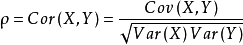       
         

##2. 计算方法举例：

<table width="173" style="border-collapse:collapse;width:129.75pt;"><colgroup><col width="101"><col width="72"></colgroup><tbody><tr><td width="101" height="19" style="font-size: 12pt; vertical-align: middle; height: 14.25pt; width: 75.75pt;">X</td><td width="72" height="19" style="font-size: 12pt; vertical-align: middle; height: 14.25pt; width: 54pt;">Y</td></tr><tr><td width="101" height="19" style="font-size: 12pt; vertical-align: middle; height: 14.25pt; width: 75.75pt;">1</td><td width="72" height="19" style="font-size: 12pt; vertical-align: middle; height: 14.25pt; width: 54pt;">10</td></tr><tr><td width="101" height="19" style="font-size: 12pt; vertical-align: middle; height: 14.25pt; width: 75.75pt;">3</td><td width="72" height="19" style="font-size: 12pt; vertical-align: middle; height: 14.25pt; width: 54pt;">12</td></tr><tr><td width="101" height="19" style="font-size: 12pt; vertical-align: middle; height: 14.25pt; width: 75.75pt;">8</td><td width="72" height="19" style="font-size: 12pt; vertical-align: middle; height: 14.25pt; width: 54pt;">24</td></tr><tr><td width="101" height="19" style="font-size: 12pt; vertical-align: middle; height: 14.25pt; width: 75.75pt;">7</td><td width="72" height="19" style="font-size: 12pt; vertical-align: middle; height: 14.25pt; width: 54pt;">21</td></tr><tr><td width="101" height="19" style="font-size: 12pt; vertical-align: middle; height: 14.25pt; width: 75.75pt;">9</td><td width="72" height="19" style="font-size: 12pt; vertical-align: middle; height: 14.25pt; width: 54pt;">34</td></tr><tr><td width="101" height="19" style="font-size: 12pt; vertical-align: middle; height: 14.25pt; width: 75.75pt;"> </td><td width="72" height="19" style="font-size: 12pt; vertical-align: middle; height: 14.25pt; width: 54pt;"> </td></tr></tbody></table>

       

##3. 其他例子：

 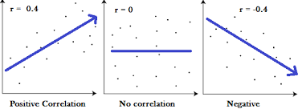
          

        

##4. R平方值:

     4.1定义：决定系数，反应因变量的全部变异能通过回归关系被自变量解释的比例。

     4.2 描述：如R平方为0.8，则表示回归关系可以解释因变量80%的变异。换句话说，如果我们能控制自变量不变，则因变量的变异程度会减少80%

     4.3： 简单线性回归：R^2 = r * r
              多元线性回归：
     
                  
   

 
##5. R平方也有其局限性：R平方随着自变量的增加会变大，R平方和样本量是有关系的。因此，我们要到R平方进行修正。修正的方法：
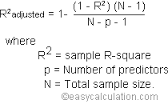 

Python实现： 

<pre>
import numpy as np
from astropy.units import Ybarn
import math

def computeCorrelation(X, Y):
    xBar = np.mean(X)
    yBar = np.mean(Y)
    SSR = 0
    varX = 0
    varY = 0
    for i in range(0 , len(X)):
        diffXXBar = X[i] - xBar
        diffYYBar = Y[i] - yBar
        SSR += (diffXXBar * diffYYBar)
        varX +=  diffXXBar**2
        varY += diffYYBar**2
    
    SST = math.sqrt(varX * varY)
    return SSR / SST

testX = [1, 3, 8, 7, 9]
testY = [10, 12, 24, 21, 34]

print computeCorrelation(testX, testY)      
</pre>           
   

****
****
##1. 归类：  
          聚类(clustering) 属于非监督学习 (unsupervised learning)
          无类别标记(class label)

##2. 举例：

          
##3. K-means 算法：

     3.1 Clustering 中的经典算法，数据挖掘十大经典算法之一
     3.2 算法接受参数 k ；然后将事先输入的n个数据对象划分为 k个聚类以便使得所获得的聚类满足：同一
           聚类中的对象相似度较高；而不同聚类中的对象相似度较小。
     3.3 算法思想：
           以空间中k个点为中心进行聚类，对最靠近他们的对象归类。通过迭代的方法，逐次更新各聚类中心     
           的值，直至得到最好的聚类结果
     3.4 算法描述：
          
          （1）适当选择c个类的初始中心；
          （2）在第k次迭代中，对任意一个样本，求其到c各中心的距离，将该样本归到距离最短的中心所在     
                  的类；
          （3）利用均值等方法更新该类的中心值；
          （4）对于所有的c个聚类中心，如果利用（2）（3）的迭代法更新后，值保持不变，则迭代结束，
                   否则继续迭代。
     3.5 算法流程：

          
          输入：k, data[n];
          （1） 选择k个初始中心点，例如c[0]=data[0],…c[k-1]=data[k-1];
          （2） 对于data[0]….data[n], 分别与c[0]…c[k-1]比较，假定与c[i]差值最少，就标记为i;
          （3） 对于所有标记为i点，重新计算c[i]={ 所有标记为i的data[j]之和}/标记为i的个数；
          （4） 重复(2)(3),直到所有c[i]值的变化小于给定阈值。

##4. 举例：
     
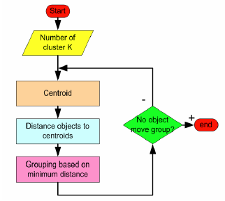     
     
    
  
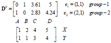  
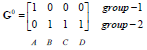  
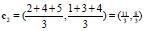  
  
  
  
 
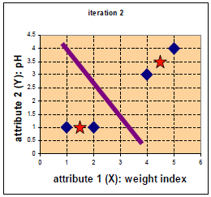

停止

          

优点：速度快，简单
缺点：最终结果跟初始点选择相关，容易陷入局部最优，需直到k值

Reference:
[http://croce.ggf.br/dados/K%20mean%20Clustering1.pdf](http://croce.ggf.br/dados/K%20mean%20Clustering1.pdf)
   

<pre>
import numpy as np

# Function: K Means
# -------------
# K-Means is an algorithm that takes in a dataset and a constant
# k and returns k centroids (which define clusters of data in the
# dataset which are similar to one another).
def kmeans(X, k, maxIt):
    
    numPoints, numDim = X.shape
    
    dataSet = np.zeros((numPoints, numDim + 1))
    dataSet[:, :-1] = X
    
    # Initialize centroids randomly
    centroids = dataSet[np.random.randint(numPoints, size = k), :]
    centroids = dataSet[0:2, :]
    #Randomly assign labels to initial centorid
    centroids[:, -1] = range(1, k +1)
    
    # Initialize book keeping vars.
    iterations = 0
    oldCentroids = None
    
    # Run the main k-means algorithm
    while not shouldStop(oldCentroids, centroids, iterations, maxIt):
        print "iteration: \n", iterations
        print "dataSet: \n", dataSet
        print "centroids: \n", centroids
        # Save old centroids for convergence test. Book keeping.
        oldCentroids = np.copy(centroids)
        iterations += 1
        
        # Assign labels to each datapoint based on centroids
        updateLabels(dataSet, centroids)
        
        # Assign centroids based on datapoint labels
        centroids = getCentroids(dataSet, k)
        
    # We can get the labels too by calling getLabels(dataSet, centroids)
    return dataSet
# Function: Should Stop
# -------------
# Returns True or False if k-means is done. K-means terminates either
# because it has run a maximum number of iterations OR the centroids
# stop changing.
def shouldStop(oldCentroids, centroids, iterations, maxIt):
    if iterations > maxIt:
        return True
    return np.array_equal(oldCentroids, centroids)  
# Function: Get Labels
# -------------
# Update a label for each piece of data in the dataset. 
def updateLabels(dataSet, centroids):
    # For each element in the dataset, chose the closest centroid. 
    # Make that centroid the element's label.
    numPoints, numDim = dataSet.shape
    for i in range(0, numPoints):
        dataSet[i, -1] = getLabelFromClosestCentroid(dataSet[i, :-1], centroids)
    
    
def getLabelFromClosestCentroid(dataSetRow, centroids):
    label = centroids[0, -1];
    minDist = np.linalg.norm(dataSetRow - centroids[0, :-1])
    for i in range(1 , centroids.shape[0]):
        dist = np.linalg.norm(dataSetRow - centroids[i, :-1])
        if dist < minDist:
            minDist = dist
            label = centroids[i, -1]
    print "minDist:", minDist
    return label
    
        
    
# Function: Get Centroids
# -------------
# Returns k random centroids, each of dimension n.
def getCentroids(dataSet, k):
    # Each centroid is the geometric mean of the points that
    # have that centroid's label. Important: If a centroid is empty (no points have
    # that centroid's label) you should randomly re-initialize it.
    result = np.zeros((k, dataSet.shape[1]))
    for i in range(1, k + 1):
        oneCluster = dataSet[dataSet[:, -1] == i, :-1]
        result[i - 1, :-1] = np.mean(oneCluster, axis = 0)
        result[i - 1, -1] = i
    
    return result
    
    
x1 = np.array([1, 1])
x2 = np.array([2, 1])
x3 = np.array([4, 3])
x4 = np.array([5, 4])
testX = np.vstack((x1, x2, x3, x4))

result = kmeans(testX, 2, 10)
print "final result:"
print result
</pre>   

假设有N个待聚类的样本，对于层次聚类来说，步骤：

       1、（初始化）把每个样本归为一类，计算每两个类之间的距离，也就是样本与样本之间的相似度；
       2、寻找各个类之间最近的两个类，把他们归为一类（这样类的总数就少了一个）；
       3、重新计算新生成的这个类与各个旧类之间的相似度；
       4、重复2和3直到所有样本点都归为一类，结束

     整个聚类过程其实是建立了一棵树，在建立的过程中，可以通过在第二步上设置一个阈值，当最近的两个类的距离大于这个阈值，则认为迭代可以终止。另外关键的一步就是第三步，如何判断两个类之间的相似度有不少种方法。这里介绍一下三种：
        SingleLinkage：又叫做 nearest-neighbor ，就是取两个类中距离最近的两个样本的距离作为这两个集合的距离，也就是说，最近两个样本之间的距离越小，这两个类之间的相似度就越大。容易造成一种叫做 Chaining 的效果，两个 cluster 明明从“大局”上离得比较远，但是由于其中个别的点距离比较近就被合并了，并且这样合并之后 Chaining 效应会进一步扩大，最后会得到比较松散的 cluster 。

       CompleteLinkage：这个则完全是 Single Linkage 的反面极端，取两个集合中距离最远的两个点的距离作为两个集合的距离。其效果也是刚好相反的，限制非常大，两个 cluster 即使已经很接近了，但是只要有不配合的点存在，就顽固到底，老死不相合并，也是不太好的办法。这两种相似度的定义方法的共同问题就是指考虑了某个有特点的数据，而没有考虑类内数据的整体特点。

       Average-linkage：这种方法就是把两个集合中的点两两的距离全部放在一起求一个平均值，相对也能得到合适一点的结果。

       average-linkage的一个变种就是取两两距离的中值，与取均值相比更加能够解除个别偏离样本对结果的干扰。

##python实现
<pre>
from numpy import *

"""
Code for hierarchical clustering, modified from 
Programming Collective Intelligence by Toby Segaran 
(O'Reilly Media 2007, page 33). 
"""

class cluster_node:
    def __init__(self,vec,left=None,right=None,distance=0.0,id=None,count=1):
        self.left=left
        self.right=right
        self.vec=vec
        self.id=id
        self.distance=distance
        self.count=count #only used for weighted average 

def L2dist(v1,v2):
    return sqrt(sum((v1-v2)**2))
    
def L1dist(v1,v2):
    return sum(abs(v1-v2))

# def Chi2dist(v1,v2):
#     return sqrt(sum((v1-v2)**2))

def hcluster(features,distance=L2dist):
    #cluster the rows of the "features" matrix
    distances={}
    currentclustid=-1

    # clusters are initially just the individual rows
    clust=[cluster_node(array(features[i]),id=i) for i in range(len(features))]

    while len(clust)>1:
        lowestpair=(0,1)
        closest=distance(clust[0].vec,clust[1].vec)
    
        # loop through every pair looking for the smallest distance
        for i in range(len(clust)):
            for j in range(i+1,len(clust)):
                # distances is the cache of distance calculations
                if (clust[i].id,clust[j].id) not in distances: 
                    distances[(clust[i].id,clust[j].id)]=distance(clust[i].vec,clust[j].vec)
        
                d=distances[(clust[i].id,clust[j].id)]
        
                if d<closest:
                    closest=d
                    lowestpair=(i,j)
        
        # calculate the average of the two clusters
        mergevec=[(clust[lowestpair[0]].vec[i]+clust[lowestpair[1]].vec[i])/2.0 \
            for i in range(len(clust[0].vec))]
        
        # create the new cluster
        newcluster=cluster_node(array(mergevec),left=clust[lowestpair[0]],
                             right=clust[lowestpair[1]],
                             distance=closest,id=currentclustid)
        
        # cluster ids that weren't in the original set are negative
        currentclustid-=1
        del clust[lowestpair[1]]
        del clust[lowestpair[0]]
        clust.append(newcluster)

    return clust[0]

def extract_clusters(clust,dist):
    # extract list of sub-tree clusters from hcluster tree with distance<dist
    clusters = {}
    if clust.distance<dist:
        # we have found a cluster subtree
        return [clust] 
    else:
        # check the right and left branches
        cl = []
        cr = []
        if clust.left!=None: 
            cl = extract_clusters(clust.left,dist=dist)
        if clust.right!=None: 
            cr = extract_clusters(clust.right,dist=dist)
        return cl+cr 
        
def get_cluster_elements(clust):
    # return ids for elements in a cluster sub-tree
    if clust.id>=0:
        # positive id means that this is a leaf
        return [clust.id]
    else:
        # check the right and left branches
        cl = []
        cr = []
        if clust.left!=None: 
            cl = get_cluster_elements(clust.left)
        if clust.right!=None: 
            cr = get_cluster_elements(clust.right)
        return cl+cr

def printclust(clust,labels=None,n=0):
    # indent to make a hierarchy layout
    for i in range(n): print ' ',
    if clust.id<0:
        # negative id means that this is branch
        print '-'
    else:
        # positive id means that this is an endpoint
        if labels==None: print clust.id
        else: print labels[clust.id]
    
    # now print the right and left branches
    if clust.left!=None: printclust(clust.left,labels=labels,n=n+1)
    if clust.right!=None: printclust(clust.right,labels=labels,n=n+1)

def getheight(clust):
    # Is this an endpoint? Then the height is just 1
    if clust.left==None and clust.right==None: return 1
    
    # Otherwise the height is the same of the heights of
    # each branch
    return getheight(clust.left)+getheight(clust.right)

def getdepth(clust):
    # The distance of an endpoint is 0.0
    if clust.left==None and clust.right==None: return 0
    
    # The distance of a branch is the greater of its two sides
    # plus its own distance
    return max(getdepth(clust.left),getdepth(clust.right))+clust.distance
      
      

</pre>                        