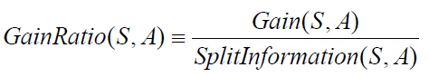

#决策树
##1.是什么
	
决策树又称为判定树，是运用于分类的一种树结构，其中的每个内部节点代表对某一属性的一次测试，每条边代表一个测试结果，叶节点代表某个类或类的分布。

决策树的决策过程需要从决策树的根节点开始，待测数据与决策树中的特征节点进行比较，并按照比较结果选择选择下一比较分支，直到叶子节点作为最终的决策结果。

##2.决策树的学习过程
特征选择：从训练数据的特征中选择一个特征作为当前节点的分裂标准（特征选择的标准不同产生了不同的特征决策树算法）。

决策树生成：根据所选特征评估标准，从上至下递归地生成子节点，直到数据集不可分则停止决策树停止声场。

剪枝：决策树容易过拟合，需要剪枝来缩小树的结构和规模（包括预剪枝和后剪枝）。

实现决策树的算法包括ID3、C4.5算法等。

###ID3算法
ID3算法是由Ross Quinlan提出的决策树的一种算法实现，以信息论为基础，以信息熵和信息增益为衡量标准，从而实现对数据的归纳分类。

ID3算法是建立在奥卡姆剃刀的基础上：越是小型的决策树越优于大的决策树（be simple简单理论）。

	奥卡姆剃刀（Occam's Razor, Ockham's Razor），又称“奥坎的剃刀”，是由14世纪逻辑学家、圣方济各会修士奥卡姆的威廉（William of Occam，约1285年至1349年）提出，他在《箴言书注》2卷15题说“切勿浪费较多东西，去做‘用较少的东西，同样可以做好的事情’。简单点说，便是：be simple。

###算法缺陷
ID3算法可用于划分标准称型数据，但存在一些问题：

	没有剪枝过程，为了去除过渡数据匹配的问题，可通过裁剪合并相邻的无法产生大量信息增益的叶子节点;
	信息增益的方法偏向选择具有大量值的属性，也就是说某个属性特征索取的不同值越多，那么越有可能作为分裂属性，这样是不合理的；
	只可以处理离散分布的数据特征

###属性选择
ID3算法的核心思想是以信息增益度量属性选择，选择分裂后信息增益最大的属性进行分裂。

信息熵（entropy）是用来衡量一个随机变量出现的期望值。如果信息的不确定性越大，熵的值也就越大，出现的各种情况也就越多。

其中，S为所有事件集合，p为发生概率，c为特征总数。注意：熵是以2进制位的个数来度量编码长度的，因此熵的最大值是log2C。

信息增益（information gain）是指信息划分前后的熵的变化，也就是说由于使用这个属性分割样例而导致的期望熵降低。也就是说，信息增益就是原有信息熵与属性划分后信息熵（需要对划分后的信息熵取期望值）的差值，具体计算法如下：

其中，第二项为属性A对S划分的期望信息。
###基本思想
- 	初始化属性集合和数据集合
- 	计算数据集合信息熵S和所有属性的信息熵，选择信息增益最大的属性作为当前决策节点
- 	更新数据集合和属性集合（删除掉上一步中使用的属性，并按照属性值来划分不同分支的数据集合）
- 	依次对每种取值情况下的子集重复第二步
- 	若子集只包含单一属性，则为分支为叶子节点，根据其属性值标记。
- 	完成所有属性集合的划分
注意：该算法使用了贪婪搜索，从不回溯重新考虑之前的选择情况。

**代码实现**
<pre>

#!/usr/bin/env python
# encoding:utf-8

from math import log

def calEntropy(dataSet):
    """calcuate entropy(s)
       @dateSet a training set
    """
    size = len(dataSet)
    laberCount = {}
    for item in dataSet:
        laber = item[-1]
        if laber not in laberCount.keys():
            laberCount[laber] = 0
        laberCount[laber] += 1
    entropy = 0.0
    for laber in laberCount:
        prob = float(laberCount[laber])/size
        entropy -= prob * log(prob, 2)
    return entropy

def splitDataSet(dataSet, i, value):
    """split data set by value with a laber
       @dataSet a training sets
       @i the test laber axis
       @value the test value
    """
    retDataSet = []
    for item in dataSet:
        if item[i] == value:
            newData = item[:i]
            newData.extend(item[i+1:])
            retDataSet.append(newData)
    return retDataSet

def chooseBestLaber(dataSet):
    """choose the best laber in labers
       @dataSet a traing set
    """
    numLaber = len(dataSet[0]) - 1
    baseEntropy = calEntropy(dataSet)
    maxInfoGain = 0.0
    bestLaber = -1
    size = len(dataSet)
    for i in range(numLaber):
        uniqueValues = set([item[i] for item in dataSet])
        newEntropy = 0.0
        for value in uniqueValues:
            subDataSet = splitDataSet(dataSet, i, value)
            prob = float(len(subDataSet))/size
            newEntropy += prob * calEntropy(subDataSet)
        infoGain = baseEntropy - newEntropy
        if infoGain > maxInfoGain:
            maxInfoGain = infoGain
            bestLaber = i
    return bestLaber

class Node:
    """the node of tree"""
    def __init__(self, laber, val):
        self.val = val
        self.left = None
        self.right = None
        self.laber = laber

    def setLeft(self, node):
        self.left = node

    def setRight(self, node):
        self.right = node

signalNode = []

def generateNode(lastNode, dataSet, labers):
    leftDataSet = filter(lambda x:x[-1]==0, dataSet)
    rightDataSet = filter(lambda x:x[-1]==1, dataSet)
    print "left:", leftDataSet
    print "right:", rightDataSet
    print "labers:", labers

    if len(leftDataSet) == 0 and len(rightDataSet) == 0:
        return

    next = 0
    print "%s ->generate left"%lastNode.laber
    if len(leftDataSet) == 0:
        print ">>> pre:%s %d stop no"%(lastNode.laber, 0)
        lastNode.setLeft(Node("no", 0))
    elif len(leftDataSet) == len(dataSet):
        print ">>> pre:%s %d stop yes"%(lastNode.laber, 0)
        lastNode.setLeft(Node("yes", 0))
    else:
        laber = chooseBestLaber(leftDataSet)
        if laber == -1:
            print ">>> can't find best one"
            laber = next
            next = (next + 1)%len(labers)
        print ">>> ",labers[laber]
        leftLabers = labers[:laber] + labers[laber+1:]
        leftDataSet = map(lambda x:x[0:laber] + x[laber+1:], leftDataSet)
        node = Node(labers[laber], 0)
        lastNode.setLeft(node)
        generateNode(node, leftDataSet, leftLabers)

    print "%s ->generate right"%lastNode.laber
    if len(rightDataSet) == 0:
        print ">>> pre:%s %d no"%(lastNode.laber, 1)
        lastNode.setRight(Node("no", 1))
    elif len(rightDataSet) == len(dataSet):
        print ">>> pre:%s %d yes"%(lastNode.laber, 1)
        lastNode.setRight(Node("yes", 1))
    else:
        laber = chooseBestLaber(rightDataSet)
        if laber == -1:
            print ">>> can't find best one"
            laber = next
            next = (next + 1)%len(labers)
        print ">>> ",labers[laber]
        rightLabers = labers[:laber] + labers[laber+1:]
        rightDataSet = map(lambda x:x[0:laber] + x[laber+1:], rightDataSet)
        node = Node(labers[laber], 0)
        lastNode.setRight(node)
        generateNode(node, rightDataSet, rightLabers)

def generateDecisionTree(dataSet, labers):
    """generate a decision tree
       @dataSet a training sets
       @labers a list of feature laber
    """
    root = None
    laber = chooseBestLaber(dataSet)
    if laber == -1:
        print "can't find a best laber in labers"
        return None
    print ">>>> ",labers[laber]
    root = Node(labers[laber], 1)
    labers = labers[:laber] + labers[laber+1:]
    dataSet = map(lambda x:x[0:laber] + x[laber+1:], dataSet)
    generateNode(root, dataSet, labers)
    return root

"""
price       size   color  result
----        ----   ----   ----
cheap       big    white  like
cheap       small  white  like
expensive   big    white  like 
expensive   small  white  like

cheap       small  black  don't like
cheap       big    black  don't like
expensive   big    black  don't like
expensive   small  black  don't like

"""
dataSet = [
    [0, 1, 1, 1],
    [0, 0, 1, 1],
    [1, 1, 1, 1],
    [1, 0, 1, 1],
    [0, 0, 0, 0],
    [0, 1, 0, 0],
    [1, 1, 0, 0],
    [1, 0, 0, 0]]

labers = ["price", "size", "color"]

if __name__ == "__main__":
    generateDecisionTree(dataSet, labers)
</pre>

##C4.5算法
C4.5算法是ID3算法的一种改进。
###改进
- 	用信息增益率来选择属性，克服了用信息增益选择属性偏向选择多值属性的不足
- 	在构造树的过程中进行剪枝
- 	对连续属性进行离散化
- 	能够对不完整的数据进行处理

###信息增益率
设样本集S按离散属性F的c个不同的取值划分为c个子集，则这c个子集的信息熵为：

信息增益率是信息增益与信息熵的比例，如下：

### 离散化处理
- 	将连续型的属性变量进行离散化处理形成决策树的训练集：
- 	将需要处理的样本（对应根节点）或样本子集（对应子树）按照连续变量的大小从小到大进行排序
- 	假设该属性对应不同的属性值共N个，那么总共有N-1个可能的候选分割值点，每个候选的分割阈值点的值为上述排序后的属性值中两两前后连续元素的中点
- 	用信息增益选择最佳划分

###不完整数据处理
处理缺少属性值的一种策略是赋给该节点所有对应训练实例中该属性最常见的值，另一种复杂的情况是为该节点每个可能出现的值赋予一个概率。

**参考：**
http://www.cnblogs.com/leoo2sk/archive/2010/09/19/decision-tree.html
http://blog.csdn.net/google19890102/article/details/28611225
http://www.cnblogs.com/biyeymyhjob/archive/2012/07/23/2605208.html